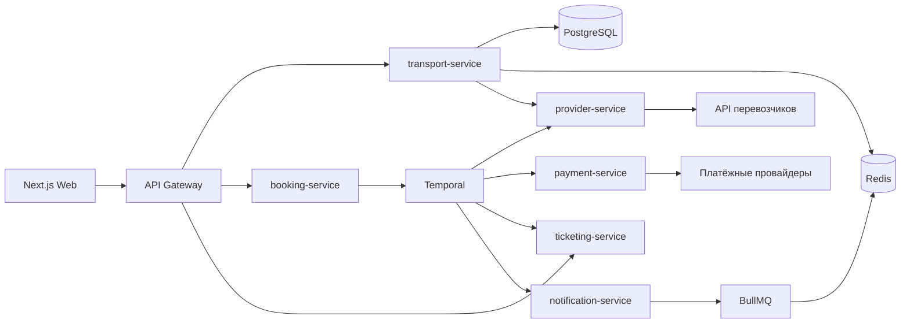
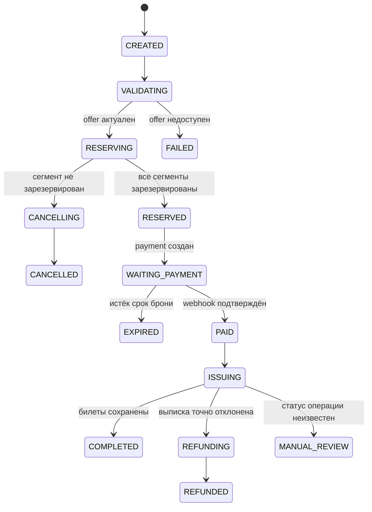

# Архитектура поиска маршрутов и покупки билетов DonBilet

## 1. Назначение документа

Документ фиксирует целевую архитектуру следующих процессов:

- поиск городов, направлений, маршрутов и рейсов;
- получение цен и доступности мест;
- бронирование одного или нескольких сегментов;
- создание платежа и обработка результата оплаты;
- выписка билетов;
- формирование PDF и отправка уведомлений;
- отмена бронирования и возврат билетов;
- постепенный переход со старого backend DonBilet.

Документ дополняет:

- [`docs/plan-tz/DonBilet — технологический стек и целевая архитектура.md`](docs/plan-tz/DonBilet%20%E2%80%94%20%D1%82%D0%B5%D1%85%D0%BD%D0%BE%D0%BB%D0%BE%D0%B3%D0%B8%D1%87%D0%B5%D1%81%D0%BA%D0%B8%D0%B9%20%D1%81%D1%82%D0%B5%D0%BA%20%D0%B8%20%D1%86%D0%B5%D0%BB%D0%B5%D0%B2%D0%B0%D1%8F%20%D0%B0%D1%80%D1%85%D0%B8%D1%82%D0%B5%D0%BA%D1%82%D1%83%D1%80%D0%B0.md);
- [`backend/docs/adr/ADR-0001-service-boundaries.md`](backend/docs/adr/ADR-0001-service-boundaries.md);
- [`backend/docs/adr/ADR-0004-search-in-postgres.md`](backend/docs/adr/ADR-0004-search-in-postgres.md);
- [`backend/docs/adr/ADR-0006-scopes-for-b2c-platform.md`](backend/docs/adr/ADR-0006-scopes-for-b2c-platform.md);
- [`audit/CURRENT.md`](audit/CURRENT.md).

## 2. Итоговое решение

| Задача | Технология |
|---|---|
| Публичный поиск | Синхронный REST, PostgreSQL и Redis |
| Нормализация данных перевозчиков | `provider-service` и каноническая транспортная модель |
| Критичный процесс покупки | Temporal `BookingWorkflow` |
| Критичный процесс возврата | Temporal `RefundWorkflow` |
| Короткие фоновые задачи | BullMQ и Redis |
| Email, SMS и MAX | `notification-service` и BullMQ |
| Синхронизация расписаний | BullMQ Scheduler |
| Генерация PDF | BullMQ либо отдельная Temporal Activity, если документ критичен для завершения заказа |
| Межсервисные команды | Внутренний HTTP REST |
| Широкая событийная шина | RabbitMQ не используется на первом этапе |

Ключевое решение:

> Поиск выполняется синхронно и не запускает workflow. Покупка и возврат являются
> долгоживущими бизнес-процессами и управляются Temporal. BullMQ используется
> только для коротких повторяемых фоновых задач. RabbitMQ не является заменой
> Temporal и пока не добавляется.

### 2.1. Утверждённые решения ближайшей Legacy-фазы

| Вопрос | Решение |
|---|---|
| Кто оркестрирует покупку | Legacy владеет цепочкой `/start/ticket → /reserve/addpass → /reserve/buy → /reserve/result` |
| Откуда берутся рейсы | Живой Legacy `/search` + Redis, `stale-while-revalidate` и single-flight |
| Что делать с неоплаченной бронью без отмены | Ждать TTL провайдера; временный локальный deadline — 15 минут |
| Как получать результат оплаты | Поллинг `/reserve/result` с backoff `2 → 4 → 8` секунд и timeout Activity 10 секунд |

На этой фазе Temporal запускает `LegacyPurchaseTrackingWorkflow`: он не владеет
деньгами и резервом, а надёжно ожидает результат Legacy, ведёт shadow-состояние,
дотягивает PDF и инициирует уведомления. Полноценный `BookingWorkflow` включается
только после переноса под наш контроль хотя бы одного провайдера и одного
платёжного шлюза.

После временного 15-минутного deadline бронь получает статус
`EXPIRED_UNCONFIRMED`, а не «точно отменена». Точный TTL требуется получить по
каждому провайдеру.

## 3. Почему Temporal, а не RabbitMQ

RabbitMQ отвечает за доставку сообщений. Он не хранит полноценное состояние
бизнес-процесса покупки и самостоятельно не предоставляет:

- последовательность шагов заказа;
- ожидание платежа в течение срока бронирования;
- бизнес-таймеры;
- компенсирующие действия;
- безопасное продолжение процесса после рестарта;
- версионирование выполняющихся процессов;
- единое представление состояния конкретной покупки.

При реализации покупки только через RabbitMQ потребуется самостоятельно создать:

- saga state machine;
- transactional outbox и inbox;
- дедупликацию каждого сообщения;
- retry policy и backoff;
- Dead Letter Queue;
- таймеры истечения брони;
- компенсации частично выполненных операций;
- инструменты восстановления зависших заказов;
- административный интерфейс для ручного разбора.

Temporal предоставляет durable workflow и подходит для процессов, которые могут
занимать минуты, часы или дни и должны продолжиться после отказа процесса или
инфраструктуры.

RabbitMQ можно добавить позднее, если появится большое количество независимых
подписчиков на доменные события. Например, событие `TicketIssued` потребуется
одновременно доставлять в CRM, аналитику, программу лояльности, 1С, партнёрские
системы и хранилище данных. Даже в таком случае Temporal останется оркестратором
покупки, а RabbitMQ будет транспортом событий.

## 4. Границы сервисов

### 4.1. `transport-service`

Владеет транспортным каталогом и поиском:

- города и станции;
- перевозчики;
- маршруты и остановки;
- рейсы и расписания;
- тарифы;
- локальные снимки доступности;
- популярные направления;
- поиск прямых рейсов и маршрутов с пересадкой.

Отдельный `search-service` не создаётся.

### 4.2. `provider-service`

Является единственной точкой работы с API перевозчиков и агрегаторов. Он:

- скрывает особенности AviBus, RegionBilet и других провайдеров;
- преобразует внешние ответы в каноническую модель DonBilet;
- выполняет поиск, проверку мест, резервирование, отмену, выписку и возврат;
- применяет timeout, retry, circuit breaker и rate limiting;
- хранит соответствие внутренних и внешних идентификаторов;
- позволяет запросить фактический статус операции после сетевого таймаута.

`provider-service` не владеет пользовательскими заказами и платежами.

### 4.3. `booking-service`

Владеет:

- `Booking`;
- `Order` и `OrderItem`;
- `Reservation`;
- пассажирами конкретного заказа;
- снимком цены и условий тарифа;
- промокодами в контексте заказа;
- багажом, страховкой и дополнительными услугами;
- состоянием checkout;
- запуском `BookingWorkflow`.

### 4.4. `payment-service`

Владеет:

- попытками оплаты;
- интеграциями со Сбером, Альфа-Банком и Payler;
- webhook платежных провайдеров;
- проверкой подписи;
- денежными возвратами;
- фискализацией;
- reconciliation;
- дедупликацией событий провайдера.

### 4.5. `ticketing-service`

Владеет:

- выписанными билетами;
- пассажирами и документами билета;
- статусом билета;
- PDF и файлами;
- условиями и расчётом возврата;
- запросами возврата;
- запуском `RefundWorkflow`.

Фактический денежный возврат выполняет `payment-service`.

### 4.6. `notification-service`

Через BullMQ выполняет:

- email;
- SMS;
- сообщения MAX;
- напоминания о поездке;
- уведомления об отмене и переносе;
- повторную доставку уведомлений.

## 5. Общая схема



## 6. Каноническая транспортная модель

Все внешние API преобразуются в единую внутреннюю модель:

```text
Provider
ProviderMapping
Carrier
City
Station
Route
RouteStop
Trip
Fare
Seat
SeatMap
Offer
Reservation
ProviderTicket
ProviderRefund
ProviderOperation
```

Базовый контракт адаптера:

```ts
interface TransportProvider {
  searchTrips(input: SearchTripsInput): Promise<ProviderTrip[]>;
  getTrip(input: GetTripInput): Promise<ProviderTrip>;
  getSeats(input: GetSeatsInput): Promise<ProviderSeat[]>;
  reserve(input: ReserveInput): Promise<ProviderReservation>;
  cancelReservation(input: CancelReservationInput): Promise<void>;
  issueTicket(input: IssueTicketInput): Promise<ProviderTicket>;
  getOperationStatus(
    input: GetOperationStatusInput,
  ): Promise<ProviderOperation>;
  refundTicket(input: RefundTicketInput): Promise<ProviderRefund>;
}
```

`getOperationStatus` обязателен. Сетевой timeout не доказывает, что внешняя
операция не выполнилась: провайдер мог оформить билет, но ответ не дошёл.

## 7. Архитектура поиска

### 7.1. Принцип

Поиск является быстрым read-only сценарием. Он не создаёт заказ и не резервирует
места.

```text
Web
  → Gateway
  → transport-service
  → PostgreSQL/Redis
  → при необходимости provider-service
  → нормализация, дедупликация и ранжирование
  → результаты Web
```

### 7.2. Справочник городов и станций

Город и станция являются разными сущностями. Пользователь выбирает объект по
стабильному внутреннему ID, а не передаёт название строкой.

Для подсказок используются:

- нормализованное название;
- альтернативные названия;
- регион и страна;
- `pg_trgm` и GIN-индекс для опечаток;
- приоритет популярных городов;
- ограниченное число результатов.

Пример API:

```http
GET /api/v1/locations/suggest?q=рост&limit=10
```

### 7.3. Поиск рейсов

Пример API:

```http
GET /api/v1/trips?departureId=<uuid>&arrivalId=<uuid>&date=2026-09-20&passengers=1&transport=bus
```

Основной индекс PostgreSQL:

```sql
(departure_city_id, arrival_city_id, departure_at)
```

Дополнительно требуются:

- частичный индекс по активным будущим рейсам;
- индекс по `provider_id` и внешнему идентификатору;
- GIN `gin_trgm_ops` по названиям городов и станций;
- индексы для поиска пересечений диапазонов расписания;
- проверка планов запросов на реальном объёме данных.

### 7.4. Гибридная выдача

Рекомендуемый режим:

1. Расписания и базовые цены периодически синхронизируются в PostgreSQL.
2. Основная выдача строится по локальному read model.
3. Результат кешируется в Redis на 15–60 секунд.
4. Актуальные места и цена проверяются перед началом бронирования.
5. Live-search вызывается только для провайдеров, которые не позволяют заранее
   загрузить расписание.

Запрещено вызывать все внешние API на каждое нажатие клавиши в форме поиска.

### 7.5. Отказ одного провайдера

Поиск должен возвращать частичный результат:

- общий deadline запроса ограничен;
- у каждого провайдера собственный timeout;
- используются circuit breaker и bulkhead;
- сбой одного провайдера не превращается в HTTP 500 всей выдачи;
- ответ может содержать технический признак неполной выдачи;
- latency и причины исключения провайдера пишутся в метрики;
- устаревший результат нельзя купить без повторной проверки.

Целевой стартовый бюджет: общий timeout 2–3 секунды. Конкретное значение
утверждается после нагрузочных и интеграционных тестов.

### 7.6. Предложение `Offer`

Результат поиска содержит краткоживущее предложение:

```ts
type Offer = {
  id: string;
  tripId: string;
  providerId: string;
  fareId: string;
  price: number;
  currency: "RUB";
  availableSeats: number | null;
  expiresAt: string;
  snapshotVersion: string;
};
```

Frontend передаёт `offerId`, но не определяет итоговую сумму. Перед созданием
бронирования backend повторно проверяет рейс, цену и места, затем сохраняет
неизменяемый снимок условий в заказе.

### 7.7. Рейсы с пересадкой

Первая версия должна поддерживать прямые рейсы. Пересадки добавляются отдельно,
начиная максимум с одной пересадки:

```text
A → X
X → B
```

Фильтры кандидатов:

- минимальное время пересадки;
- максимальное время ожидания;
- совместимость станции или города пересадки;
- максимальная общая длительность;
- доступность обоих сегментов;
- ограничение количества кандидатов до ранжирования.

Каждый сегмент получает отдельный `offerId`. Их согласованное бронирование
выполняется только через `BookingWorkflow`.

## 8. API покупки

### 8.1. Создание покупки

```http
POST /api/v1/bookings
Idempotency-Key: <uuid>
Content-Type: application/json
```

```json
{
  "offers": ["offer-outbound", "offer-return"],
  "passengerIds": ["passenger-id"],
  "services": [],
  "promoCode": null
}
```

Ответ создаётся быстро и не удерживает HTTP-соединение на весь workflow:

```json
{
  "bookingId": "uuid",
  "status": "RESERVING"
}
```

Frontend получает изменения через SSE/WebSocket либо опрашивает:

```http
GET /api/v1/bookings/{bookingId}
```

При переходе в `WAITING_PAYMENT` ответ содержит краткоживущий защищённый
`paymentUrl`.

### 8.2. Состояния Booking

```text
CREATED
VALIDATING
RESERVING
RESERVED
WAITING_PAYMENT
PAID
ISSUING
COMPLETED
EXPIRED
CANCELLING
CANCELLED
REFUNDING
REFUNDED
MANUAL_REVIEW
FAILED
```

Переходы между статусами задаются таблицей допустимых переходов. Произвольное
присваивание статуса из разных сервисов запрещено.

## 9. `BookingWorkflow`



Последовательность:

1. Загрузить Booking по ID.
2. Перепроверить все `Offer` и получить окончательную цену.
3. Сохранить снимок маршрута, тарифа, услуг и цены.
4. Зарезервировать каждый сегмент у провайдера.
5. При частичном резервировании отменить уже созданные резервы.
6. Создать `Order` и `PaymentAttempt`.
7. Перейти в `WAITING_PAYMENT`.
8. Ожидать подтверждённый signal платежа до истечения брони с safety buffer.
9. При timeout отменить резервы и перевести заказ в `EXPIRED`.
10. После оплаты выписать каждый билет.
11. При сетевом timeout сначала запросить фактический статус операции.
12. Сохранить билеты и провести фискализацию.
13. Перевести Booking в `COMPLETED`.
14. Поставить PDF и уведомления в BullMQ.

## 10. Компенсации

| Ситуация | Действие |
|---|---|
| Второй сегмент не забронировался | Отменить первый резерв |
| Пользователь не оплатил до deadline | Отменить все резервы, заказ сделать `EXPIRED` |
| Платёж пришёл после истечения брони | Проверить реальный статус резервов и выполнить контролируемый refund |
| Выписка точно отклонена после оплаты | Вернуть деньги и отменить доступные резервы |
| Запрос выписки завершился таймаутом | Запросить статус у провайдера, не повторять операцию вслепую |
| Провайдер не может подтвердить статус | Перевести в `MANUAL_REVIEW` |
| PDF или уведомление не сформировались | Повторить BullMQ-задачу, не отменять действительный билет |
| Фискализация временно недоступна | Повторять отдельную идемпотентную операцию и создать алерт |

Нельзя автоматически возвращать деньги только на основании timeout: билет мог
быть выписан, а ответ мог потеряться.

## 11. Платёжный webhook

Обработка выполняется в следующем порядке:

1. Прочитать оригинальное тело запроса.
2. Проверить подпись согласно правилам конкретного провайдера.
3. Получить внешний ID события и ID платежа.
4. Попытаться создать `PaymentProviderEvent` с уникальным ограничением.
5. Если событие уже существует, вернуть успешный ответ без повторной обработки.
6. Проверить допустимость перехода статуса платежа.
7. Обновить платеж и создать outbox-событие в одной транзакции.
8. Outbox-dispatcher отправляет signal в `BookingWorkflow`.
9. Результат обработки записывается в audit log без секретов и платёжных данных.

Редирект пользователя после оплаты не является подтверждением платежа. Источник
истины — проверенный серверный webhook и reconciliation с платёжным провайдером.

## 12. Transactional outbox

Создание Booking и запуск workflow нельзя выполнять как две неатомарные команды:

```text
INSERT booking
startWorkflow()
```

Процесс может завершиться между ними. Надёжный вариант:

1. В одной транзакции создать `Booking` и `OutboxEvent` типа
   `START_BOOKING_WORKFLOW`.
2. Dispatcher читает outbox и запускает Temporal.
3. Workflow получает детерминированный ID `booking:{bookingId}`.
4. Повторный запуск с тем же ID не создаёт второй процесс.
5. После подтверждённого запуска outbox-событие отмечается доставленным.

Та же схема используется для сигналов платежа и публикации внешних доменных
событий.

## 13. Идемпотентность

Все критические операции принимают ключ идемпотентности:

```text
booking:create:{clientIdempotencyKey}
provider:reserve:{bookingId}:{segmentId}
provider:cancel:{bookingId}:{reservationId}
payment:create:{bookingId}:{attemptNumber}
ticket:issue:{bookingId}:{segmentId}
payment:refund:{paymentId}:{refundNumber}
provider:refund:{ticketId}:{refundNumber}
```

Требования:

- ключ имеет уникальное ограничение в БД;
- повторный запрос возвращает результат первоначальной операции;
- тело повторного запроса сверяется с хешем первоначального payload;
- одинаковый ключ с другим payload возвращает конфликт;
- ключ передаётся внешнему провайдеру, если его API это поддерживает;
- если внешний API не поддерживает ключ, перед повтором вызывается
  `getOperationStatus`;
- критические consumer и Activity всегда допускают повторное выполнение.

Гарантия `exactly once` между DonBilet, банком и перевозчиком недостижима.
Практическая модель — `at least once` плюс идемпотентность, дедупликация и
reconciliation.

## 14. Правила разработки Temporal

- Workflow содержит только детерминированную оркестрацию.
- HTTP, PostgreSQL, Redis, системное время и SDK провайдеров вызываются только
  через Activities.
- В workflow передаются идентификаторы, а не документы пассажиров, банковские
  данные и другие чувствительные payload.
- Каждая Activity атомарна настолько, насколько позволяет внешняя система.
- Бизнес-ошибки вроде `SEAT_NOT_AVAILABLE` не ретраятся.
- Временные сетевые ошибки ретраятся с exponential backoff и jitter.
- Для Activities задаются `startToCloseTimeout`, `scheduleToCloseTimeout` и при
  необходимости heartbeat.
- Длительное ожидание оплаты реализуется durable timer и signal, а не `sleep`
  внутри Node.js-процесса.
- Для выполняющихся workflow применяется безопасное versioning.
- Состояние для Web и CRM читается из PostgreSQL, а не напрямую из Temporal.
- Workflow ID всегда детерминирован и связан с доменной сущностью.

## 15. `RefundWorkflow`

```text
Запрос возврата
  → проверка принадлежности билета
  → проверка статуса и условий возврата
  → расчёт суммы
  → подтверждение клиента или сотрудника
  → возврат билета провайдеру
  → денежный refund
  → фискальный чек возврата
  → обновление статуса билета
  → уведомление клиента
```

Как и при покупке, timeout операции возврата переводит процесс в проверку
фактического статуса, а не в немедленный повтор.

## 16. Задачи BullMQ

BullMQ используется для коротких, атомарных и повторяемых задач:

- отправка email, SMS и MAX;
- генерация PDF;
- синхронизация городов, станций и расписаний;
- периодическое обновление цен;
- reconciliation платежей;
- напоминания о поездке;
- проверка снижения цены;
- экспорт отчётов;
- очистка просроченного кеша;
- обработка изображений.

Каждая задача должна иметь:

- стабильный `jobId` или deduplication ID;
- ограниченное число попыток;
- exponential backoff с jitter;
- timeout;
- сохранение failed job для диагностики;
- метрики длительности и числа ошибок;
- идемпотентный обработчик.

BullMQ не используется как замена `BookingWorkflow` или `RefundWorkflow`.

## 17. Минимальная модель данных

### 17.1. Global scope

Публичные данные без `customer_id`:

```text
City
Station
Carrier
Route
RouteStop
Trip
Fare
Provider
ProviderMapping
```

### 17.2. Customer scope

Приватные данные покупателя:

```text
Booking
BookingPassenger
Order
OrderItem
Reservation
Ticket
TicketPassenger
TicketDocument
TicketRefund
Payment
PaymentRefund
FiscalReceipt
```

Они должны быть изолированы по `customer_id` и доступны сотрудникам через
отдельный workspace-контекст согласно ADR-0006.

### 17.3. Технические сущности

```text
IdempotencyRecord
ProviderOperation
PaymentProviderEvent
OutboxEvent
BookingTimeline
ReconciliationCase
```

ADR-0006 пока имеет статус `предложено`. Его необходимо утвердить до создания
схем Booking, Ticket и Payment.

## 18. Наблюдаемость

Каждый запрос и workflow должны иметь:

- `requestId`;
- `correlationId`;
- `bookingId`;
- `workflowId`;
- `paymentId`, если создан платёж;
- `providerId` и внешний operation ID;
- структурированные JSON-логи;
- трассировку межсервисных вызовов;
- метрики latency, retries, timeout и compensation;
- health/readiness endpoints;
- алерты на `MANUAL_REVIEW`, зависшие workflow и просроченные резервы.

PII, ключи API, подписи webhook, токены, номера документов и полный payload
платежа в логи не попадают.

Минимальные бизнес-метрики:

- search p50/p95/p99;
- доля частичной поисковой выдачи;
- доступность каждого провайдера;
- конверсия `search → booking → payment → ticket`;
- время от создания Booking до `WAITING_PAYMENT`;
- время от оплаты до выписки билета;
- число автоматических компенсаций;
- число заказов в `MANUAL_REVIEW`;
- доля повторных webhook;
- число расхождений reconciliation.

## 19. Тестирование

### Unit

- нормализация каждого provider response;
- дедупликация рейсов;
- ранжирование выдачи;
- таблица переходов статусов;
- расчёт цены и возврата;
- retry classification.

### Contract

- фикстуры каждого API перевозчика;
- схема запроса и ответа;
- mapping внешних ошибок;
- timeout и повторный статус операции;
- webhook каждого банка;
- совместимость с действующим API Legacy.

### Integration

- PostgreSQL и Redis;
- outbox dispatcher;
- запуск и signal Temporal workflow;
- дедупликация платежных событий;
- RLS по `customer_id`;
- восстановление worker после рестарта.

### E2E

- успешная покупка одного билета;
- туда-обратно;
- второй сегмент не забронировался;
- цена изменилась;
- место стало недоступно;
- платеж не завершён до deadline;
- повторный webhook;
- оплата прошла, выписка временно недоступна;
- неизвестный результат выписки;
- полный и частичный возврат;
- восстановление workflow после рестарта worker.

### Failure injection

Во время тестов намеренно отключать:

- provider-service;
- payment-service;
- Temporal worker;
- Redis;
- PostgreSQL-соединение;
- внешнего провайдера после принятия запроса, но до получения ответа.

## 20. Переход с Legacy

### 20.1. Текущее противоречие документации

Целевая архитектура описывает перенос booking, payment, ticketing и provider в
новую платформу. При этом `audit/CURRENT.md` фиксирует решение, что Legacy backend
пока не переписывается, а новый frontend работает через адаптер действующего API.

До начала реализации требуется отдельный ADR с ответом:

> Legacy остаётся источником истины для покупки или booking/payment/provider
> переносятся в новую платформу?

### 20.2. Если Legacy остаётся источником истины

**Это выбранный вариант для ближайшей фазы.** Temporal не должен параллельно
оркестрировать процесс, которым уже управляет Legacy. Безопасный этап:

1. Реализовать `donbilet-api-adapter`.
2. Зафиксировать контракты на Postman-фикстурах.
3. Использовать Legacy для поиска и покупки.
4. Хранить shadow-модель заказов только для наблюдаемости и миграции.
5. Добавить correlation ID и метрики вокруг каждого вызова Legacy.
6. Не повторять автоматически операции покупки с неизвестным результатом.

Этот вариант не устраняет недостатки Legacy callback и идемпотентности.

Для него используется ограниченный workflow:

```text
LegacyPurchaseTrackingWorkflow
  → создать shadow-запись
  → выполнить Legacy purchase chain
  → WAITING_LEGACY_PAYMENT
  → polling /reserve/result: 2 → 4 → 8 с, Activity timeout 10 с
  ├─ success → сохранить результат → PDF → уведомление
  ├─ terminal failure → LEGACY_FAILED
  └─ deadline/ambiguous result → UNKNOWN / MANUAL_REVIEW
```

При отсутствии метода отмены неоплаченная бронь освобождается самим провайдером
по TTL. До получения точных TTL используется 15 минут как локальный deadline,
после которого ставится `EXPIRED_UNCONFIRMED`. Бронировать только после оплаты
запрещено: при исчезновении места потребуется денежный refund, которым новый
контур пока не управляет.

### 20.3. Рекомендуемый постепенный перенос

1. Снять блокер по рабочему Legacy API и получить контакт его разработчика.
2. Создать канонический `provider-service` и адаптер Legacy.
3. Реализовать read model поиска в `transport-service`.
4. Перенести одного перевозчика под feature flag.
5. Реализовать `payment-service` с одним тестовым провайдером.
6. Добавить Temporal и `BookingWorkflow` для нового контура.
7. Провести shadow-тестирование и сверку цен/рейсов с Legacy.
8. Включить небольшой процент реальных покупок.
9. Следить за конверсией, расхождениями и `MANUAL_REVIEW`.
10. По одному переносить остальных провайдеров.
11. После полного cutover отключить Legacy из критичного runtime.

## 21. Текущие блокеры

На момент составления документа в репозитории отсутствуют:

- `transport-service`;
- `provider-service`;
- `booking-service`;
- `ticketing-service`;
- `payment-service`;
- Temporal SDK;
- Temporal worker и инфраструктура Temporal.

BullMQ уже присутствует в зависимостях backend.

Перед реализацией необходимо получить:

- актуальный base URL и ключи Legacy API;
- тестовый контур Legacy;
- контакт backend-разработчика Legacy;
- список реально активных перевозчиков;
- актуальные контракты reserve, cancel, issue, status и refund;
- TTL брони каждого провайдера;
- описание идемпотентности внешних операций;
- активного платёжного провайдера и правила проверки его webhook;
- решение по страховке, отелю, промокодам и покупке туда-обратно;
- утверждение ADR-0006 по `global`, `workspace` и `customer` scope.

## 22. Критерии готовности

- [ ] Принят ADR о границе новой платформы и Legacy.
- [ ] Утверждён ADR-0006 по скоупам данных.
- [ ] Все provider adapters проходят contract tests.
- [ ] Поиск использует стабильные ID городов и станций.
- [ ] Цена и доступность перепроверяются перед резервированием.
- [ ] Сбой одного провайдера не ломает всю выдачу.
- [ ] Создание Booking поддерживает `Idempotency-Key`.
- [ ] Workflow запускается через transactional outbox.
- [ ] Workflow ID детерминирован.
- [ ] Все Activities идемпотентны.
- [ ] Webhook проверяет подпись и дедуплицируется.
- [ ] Повторный webhook не создаёт второй билет или refund.
- [ ] Timeout внешней операции переводится в проверку статуса.
- [ ] Реализован `MANUAL_REVIEW`.
- [ ] PDF и уведомления не блокируют действительность билета.
- [ ] Реализованы reconciliation и алерты.
- [ ] Проведены failure-injection тесты.
- [ ] Проверено восстановление workflow после рестарта.
- [ ] В логах отсутствуют секреты и PII.
- [ ] RabbitMQ не добавлен без отдельного ADR и подтверждённой необходимости.

## 23. Внешние справочные материалы

- [Temporal Documentation](https://docs.temporal.io/)
- [RabbitMQ Reliability Guide](https://www.rabbitmq.com/docs/reliability)
- [RabbitMQ Consumer Acknowledgements and Publisher Confirms](https://www.rabbitmq.com/docs/confirms)
- [BullMQ: Idempotent jobs](https://docs.bullmq.io/patterns/idempotent-jobs)
- [BullMQ: Retrying failing jobs](https://docs.bullmq.io/guide/retrying-failing-jobs)
