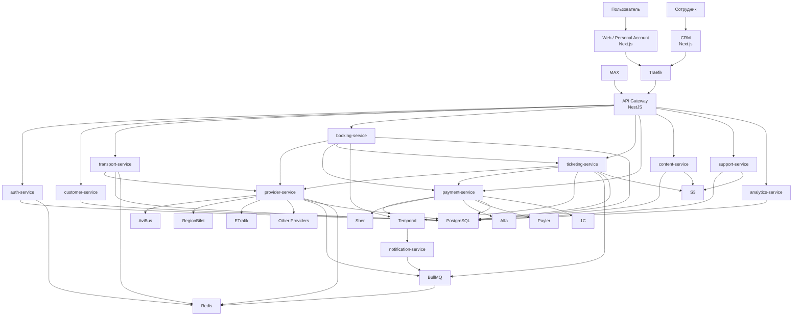
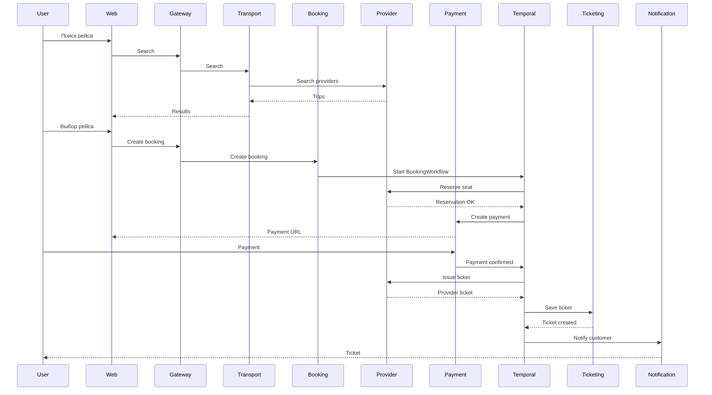
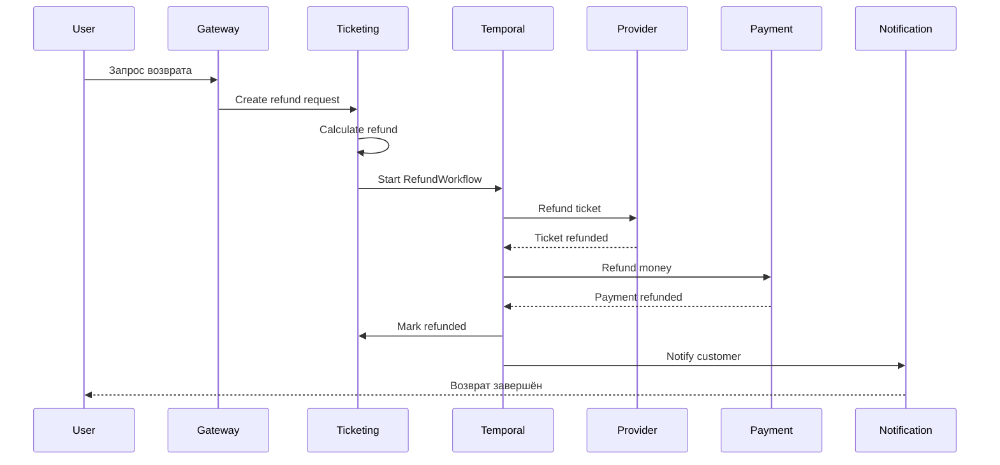

# DonBilet — технологический стек и целевая архитектура

**Версия:** 1.0  
**Статус:** целевая архитектура  
**Тип проекта:** билетная платформа / агрегатор перевозчиков  
**Архитектурный стиль:** микросервисная архитектура  
**Основной язык разработки:** TypeScript  
**Цель:** полностью заменить legacy-архитектуру на iDempiere современной self-hosted платформой.

---

# 1. Цели архитектуры

Новая архитектура DonBilet должна:

1. Полностью отказаться от iDempiere после завершения миграции.
2. Перенести backend на TypeScript + NestJS.
3. Перенести frontend на Next.js + React.
4. Создать единый CRM / Backoffice для управления системой.
5. Разделить систему по бизнес-доменам.
6. Изолировать интеграции с перевозчиками.
7. Обеспечить надёжную обработку сценариев:
   - бронирование;
   - оплата;
   - выдача билета;
   - возврат билета;
   - возврат денег.
8. Обеспечить масштабирование отдельных сервисов без масштабирования всей системы.
9. Убрать прямую зависимость бизнес-логики от ERP.
10. Иметь нормальные миграции PostgreSQL.
11. Использовать типизированный API.
12. Обеспечить идемпотентность критических операций.
13. Обеспечить аудит действий сотрудников.
14. Не усложнять инфраструктуру без необходимости.

---

# 2. Основные архитектурные принципы

## 2.1. Business domain first

Микросервисы разделяются не по техническим операциям, а по бизнес-доменам.

Не создавать отдельные сервисы вида:

- `create-order-service`;
- `search-cache-service`;
- `refund-calculation-service`;
- `payment-router-service`;
- `pdf-service`;

если соответствующая функциональность естественно относится к существующему бизнес-домену.

---

## 2.2. Умеренное количество микросервисов

Целевая архитектура содержит ограниченное количество крупных доменных сервисов.

```text
gateway
auth-service
customer-service
transport-service
booking-service
ticketing-service
payment-service
provider-service
content-service
support-service
notification-service
analytics-service
```

Не дробить систему дальше без реальной необходимости.

---

## 2.3. Каждый сервис владеет своим доменом

Сервис должен быть единственным владельцем своей бизнес-логики.

Например:

```text
booking-service
```

владеет:

- бронированием;
- заказом;
- checkout;
- pricing заказа;
- дополнительными услугами.

А:

```text
ticketing-service
```

владеет:

- жизненным циклом билета;
- выдачей;
- состоянием;
- возвратом билета.

---

## 2.4. CRM не содержит бизнес-логику

CRM является интерфейсом управления.

```text
CRM
 ↓
API Gateway
 ↓
Domain Service
```

Не допускается:

```text
CRM
 ↓
прямой SQL
```

или:

```text
CRM
 ↓
собственная логика возврата
```

Вся бизнес-логика остаётся в backend-сервисах.

---

# 3. Целевой технологический стек

| Слой | Технология |
|---|---|
| Язык | TypeScript |
| Runtime | Node.js |
| Package manager | Bun |
| Public frontend | Next.js 16 |
| UI | React 19 |
| CRM | Next.js 16 + React 19 |
| CSS | Tailwind CSS |
| UI primitives | shadcn/ui + собственный design system |
| Forms | React Hook Form |
| Validation | Zod |
| Server state | TanStack Query |
| UI state | Zustand |
| Backend | NestJS |
| API Gateway | NestJS |
| API | REST |
| API contract | OpenAPI |
| Reverse proxy | Traefik |
| Database | PostgreSQL |
| ORM | Prisma |
| Cache | Redis |
| Background jobs | BullMQ |
| Durable workflows | Temporal |
| Message broker | не используется на первом этапе |
| Object storage | S3-compatible |
| Realtime | WebSocket |
| Rich text editor | TipTap |
| Containers | Docker |
| Deployment | Docker Compose |
| Testing | Vitest / Supertest / Playwright |
| Logging | Pino structured logs |

---

# 4. Что сознательно НЕ используем

На первом этапе проекта не использовать:

```text
Kubernetes
RabbitMQ
Kafka
Redpanda
Consul
Service Mesh
Istio
gRPC
ClickHouse
Vendure
iDempiere после миграции
МойСклад
```

Причина — отсутствие необходимости на текущем масштабе.

Добавление инфраструктурного компонента допускается только при появлении конкретной проблемы, которую существующий стек уже не решает.

---

# 5. Frontend

Используются два Next.js приложения.

```text
apps/
├── web/
└── crm/
```

---

## 5.1. Web

`web` включает:

- публичный сайт;
- поиск;
- результаты поиска;
- бронирование;
- оплату;
- личный кабинет;
- мои билеты;
- историю поездок;
- сохранённых пассажиров;
- избранное;
- сообщения;
- возвраты;
- поддержку;
- SEO-страницы;
- новости;
- FAQ.

Стек:

```text
Next.js 16
React 19
TypeScript
Tailwind CSS
Zod
React Hook Form
TanStack Query
Zustand
```

---

## 5.2. CRM / Backoffice

Отдельное приложение:

```text
apps/crm
```

CRM используется сотрудниками DonBilet.

Основные разделы:

```text
Dashboard

Продажи
├── Заказы
├── Билеты
├── Возвраты
└── Платежи

Клиенты
├── Клиенты
├── Пассажиры
├── История поездок
└── Обращения

Перевозки
├── Рейсы
├── Маршруты
├── Города
├── Станции
├── Перевозчики
└── API-провайдеры

Маркетинг
├── Промокоды
├── Акции
├── Рассылки
└── Уведомления

Контент
├── Страницы
├── Новости
├── FAQ
├── Баннеры
├── SEO
└── Юридические документы

Поддержка
├── Диалоги
└── Тикеты

Аналитика

Настройки
├── Сотрудники
├── Роли
├── Интеграции
├── Конфигурация
└── Audit Log
```

---

# 6. API Gateway

Используется:

```text
NestJS Gateway
```

Gateway — единственная публичная точка входа backend.

```text
Internet
   ↓
Traefik
   ↓
Gateway
   ↓
Internal services
```

Gateway отвечает за:

- authentication;
- authorization;
- rate limiting;
- request ID;
- correlation ID;
- API versioning;
- валидацию публичных запросов;
- маршрутизацию;
- единый формат ошибок.

---

# 7. Reverse Proxy

Используется:

```text
Traefik
```

Причина:

- хорошая интеграция с Docker Compose;
- автоматическое обнаружение контейнеров;
- маршрутизация через Docker labels;
- HTTPS;
- Let's Encrypt;
- WebSocket;
- минимум ручной конфигурации.

Публичные маршруты:

```text
donbilet.ru
    → web

donbilet.ru/api/*
    → gateway

crm.donbilet.ru
    → crm
```

Внутренние микросервисы не публикуют порты в интернет.

---

# 8. Backend services

## 8.1. auth-service

Ответственность:

```text
authentication
sessions
passwords
refresh tokens
OAuth
employee authentication
RBAC
2FA
```

Поддерживаемые варианты входа:

```text
email/password
VK ID
Yandex ID
```

Технологии:

```text
NestJS
Prisma
PostgreSQL
Redis
Argon2id
JWT
HttpOnly Cookies
```

Access token:

```text
короткоживущий
```

Refresh token:

```text
HttpOnly
Secure
SameSite
```

---

# 9. customer-service

Отвечает за клиента.

```text
customers
profiles
saved passengers
favorites
trip history
ratings
customer preferences
```

Пример модели:

```text
Customer
Passenger
FavoriteRoute
TripHistory
CarrierRating
```

Документы пассажиров относятся к чувствительным данным и должны быть защищены отдельно.

---

# 10. transport-service

Объединяет транспортный каталог и поиск.

Не создавать отдельный `search-service`.

Сервис отвечает за:

```text
cities
stations
routes
route stops
carriers
schedules
trips
fares
seat maps
availability
search
popular routes
directions
```

Основной сценарий:

```text
Web
 ↓
Gateway
 ↓
transport-service
 ↓
provider-service
 ↓
Transport Provider API
```

---

# 11. provider-service

Это единая точка интеграции со всеми системами перевозчиков.

Сервис не отвечает за пользовательские заказы.

Он отвечает только за адаптацию внешних транспортных API.

Структура:

```text
provider-service/
├── core/
│   ├── provider.interface.ts
│   ├── canonical-model.ts
│   └── provider-registry.ts
│
└── adapters/
    ├── donbilet/
    ├── busfor/
    ├── avibus/
    ├── avibus-pro/
    ├── avibus-astra/
    ├── avibus-novomeh/
    ├── regionbilet/
    ├── yahont/
    ├── etrafik/
    ├── biletik/
    ├── busroute/
    └── kras/
```

Каждый адаптер реализует единый интерфейс.

```ts
interface TransportProvider {
  searchTrips(input: SearchTripsInput): Promise<Trip[]>;
  getTrip(input: GetTripInput): Promise<Trip>;
  getSeats(input: GetSeatsInput): Promise<Seat[]>;
  reserve(input: ReserveInput): Promise<Reservation>;
  cancelReservation(input: CancelReservationInput): Promise<void>;
  issueTicket(input: IssueTicketInput): Promise<IssuedTicket>;
  refundTicket(input: RefundTicketInput): Promise<RefundResult>;
}
```

---

# 12. Canonical Transport Model

Все внешние API преобразуются в единую модель DonBilet.

```text
AviBus
     \
RegionBilet
       \
ETrafik → provider-service → Canonical DonBilet Model
       /
BusRoute
     /
...
```

Основные сущности:

```text
Provider
Carrier
City
Station
Route
RouteStop
Trip
Fare
Seat
SeatMap
Reservation
ProviderTicket
ProviderRefund
```

Внутренние сервисы не должны знать специфические форматы AviBus, RegionBilet и других API.

---

# 13. booking-service

Главный сервис оформления заказа.

Объединяет:

```text
booking
reservation state
order
checkout
pricing
promo codes
baggage
insurance
additional services
```

Отдельный `order-service` не создаётся.

Основные сущности:

```text
Booking
Order
OrderItem
Reservation
BookingPassenger
PromoApplication
AdditionalService
```

Основные состояния:

```text
CREATED
RESERVING
RESERVED
WAITING_PAYMENT
PAID
ISSUING
COMPLETED
CANCELLED
FAILED
REFUNDING
REFUNDED
```

---

# 14. ticketing-service

Всё, связанное непосредственно с билетом, находится в одном сервисе.

Не создавать отдельный `ticket-service` и `refund-service`.

Сервис отвечает за:

```text
ticket
ticket issue
ticket status
ticket history
ticket PDF
ticket download
ticket validation
refund request
refund conditions
refund calculation
carrier refund
refund status
```

Основные сущности:

```text
Ticket
TicketPassenger
TicketDocument
TicketRefund
TicketRefundRule
TicketFile
```

Важно:

`ticketing-service` управляет бизнес-возвратом билета.

Фактический денежный возврат выполняет `payment-service`.

---

# 15. payment-service

Весь платёжный контур находится в одном сервисе.

Не создавать:

```text
payment-router-service
fiscal-service
reconciliation-service
```

как отдельные микросервисы.

Структура:

```text
payment-service/
├── payments/
├── refunds/
├── webhooks/
├── fiscal/
├── reconciliation/
│
└── providers/
    ├── sber/
    ├── alfa/
    └── payler/
```

Интерфейс:

```ts
interface PaymentProvider {
  createPayment(input: CreatePaymentInput): Promise<PaymentResult>;
  getStatus(id: string): Promise<PaymentStatus>;
  refund(input: RefundPaymentInput): Promise<RefundPaymentResult>;
  verifyWebhook(request: unknown): Promise<VerifiedWebhook>;
}
```

---

# 16. Требования к платежам

Обязательно:

```text
idempotency
signature verification
webhook deduplication
retry safety
audit log
```

Каждое событие платёжного провайдера должно иметь уникальный идентификатор.

Повторный webhook не должен повторно:

- менять заказ;
- выдавать билет;
- выполнять refund;
- отправлять чек.

---

# 17. content-service

Собственная CMS DonBilet.

Отдельный Strapi / Directus не используется.

Управление идёт из общей CRM.

Сущности:

```text
Page
News
FaqCategory
Faq
Banner
SeoPage
Redirect
Menu
LegalDocument
```

Редактор:

```text
TipTap
```

Файлы:

```text
S3
```

---

# 18. support-service

Отвечает за поддержку клиентов.

```text
support conversations
support messages
support tickets
operator assignment
conversation status
attachments
```

Realtime:

```text
WebSocket
```

Сценарий:

```text
Web / Personal Account
          ↓
      WebSocket
          ↓
   support-service
          ↓
        CRM
```

---

# 19. notification-service

Все исходящие пользовательские уведомления.

Каналы:

```text
Email
SMS
MAX
Push — позже
```

Сервис отвечает за:

```text
templates
delivery
retry
delivery status
channel selection
```

Фактическая отправка выполняется через BullMQ jobs.

---

# 20. analytics-service

Отвечает за бизнес-аналитику.

На первом этапе отдельный ClickHouse не используется.

Используется:

```text
PostgreSQL
```

Сервис хранит собственные:

```text
aggregates
daily metrics
funnel metrics
provider statistics
sales statistics
```

Основные показатели:

```text
revenue
orders
tickets
refunds
average check
conversion
payment success rate
provider error rate
popular routes
customers
repeat purchase rate
```

Если объём событий значительно вырастет, допускается последующий перенос аналитического хранилища в ClickHouse.

---

# 21. Temporal

Temporal используется только для критичных долгоживущих бизнес-процессов.

Temporal не используется вместо всего backend.

Основные workflows:

```text
BookingWorkflow
RefundWorkflow
```

---

## 21.1. BookingWorkflow

```text
Create booking
      ↓
Reserve seat
      ↓
Create order
      ↓
Create payment
      ↓
Wait payment
      ↓
Payment successful
      ↓
Issue ticket
      ↓
Save ticket
      ↓
Generate PDF
      ↓
Notify customer
      ↓
Complete
```

Пример компенсации:

```text
Payment successful
      ↓
Ticket issuance failed
      ↓
retry
      ↓
retry
      ↓
still failed
      ↓
refund payment
      ↓
release reservation
      ↓
mark booking failed
      ↓
notify customer
```

---

## 21.2. RefundWorkflow

```text
Refund requested
      ↓
Validate refund
      ↓
Calculate amount
      ↓
Return ticket to provider
      ↓
Refund payment
      ↓
Create fiscal refund
      ↓
Update ticket
      ↓
Notify customer
```

Temporal должен обеспечивать:

```text
retry
timeouts
workflow state
durability
compensation
recovery after server restart
```

---

# 22. BullMQ

BullMQ используется для коротких фоновых задач.

Backend:

```text
Redis
```

Использовать для:

```text
send email
send SMS
send MAX message
generate PDF
provider synchronization
schedule synchronization
exports
reports
cleanup
image processing
```

Не использовать BullMQ как замену Temporal для критичных многошаговых бизнес-процессов.

---

# 23. RabbitMQ

На первом этапе:

```text
RabbitMQ НЕ используется.
```

Причина:

для текущей архитектуры достаточно:

```text
REST
+
Temporal
+
BullMQ
```

Добавление RabbitMQ допускается позже, если появится реальная необходимость в широком event-driven pub/sub между большим количеством независимых consumers.

---

# 24. Взаимодействие микросервисов

## Синхронные операции

Использовать внутренний:

```text
HTTP REST
```

Примеры:

```text
booking-service → provider-service

booking-service → payment-service

ticketing-service → provider-service

ticketing-service → payment-service
```

Внутренние сервисы доступны только внутри Docker network.

---

## Долгие бизнес-процессы

Использовать:

```text
Temporal
```

---

## Background jobs

Использовать:

```text
BullMQ
```

---

# 25. PostgreSQL

Используется один PostgreSQL instance / cluster.

Не поднимать отдельный PostgreSQL server на каждый микросервис.

Логическое разделение:

```text
PostgreSQL
├── auth
├── customers
├── transport
├── booking
├── ticketing
├── payments
├── providers
├── content
├── support
├── notifications
└── analytics
```

Каждый сервис имеет доступ только к своей схеме.

---

# 26. Правило владения данными

Запрещено:

```text
booking-service
    ↓
SELECT FROM payments.payment
```

Правильно:

```text
booking-service
    ↓
payment-service API
```

Даже если сервисы физически используют один PostgreSQL server.

---

# 27. Prisma

Каждый сервис должен владеть своей Prisma schema или соответствующей частью общей схемы.

Пример:

```text
prisma/
├── auth.prisma
├── customer.prisma
├── transport.prisma
├── booking.prisma
├── ticketing.prisma
├── payment.prisma
├── provider.prisma
├── content.prisma
├── support.prisma
└── analytics.prisma
```

Все изменения БД проводятся только через миграции.

Прямые ручные изменения production schema запрещены.

---

# 28. Redis

Redis используется для:

```text
cache
sessions metadata
rate limits
short-lived locks
BullMQ
temporary search data
provider response cache
```

Redis не является источником истины.

Основные данные всегда сохраняются в PostgreSQL.

---

# 29. S3

S3-compatible object storage используется для:

```text
PDF tickets
news images
banner images
support attachments
exports
generated reports
```

В PostgreSQL хранятся только:

```text
object key
metadata
file size
mime type
owner
created_at
```

---

# 30. MAX Bot

MAX Bot является отдельным входным каналом.

Он не содержит бизнес-логику покупки билета.

Схема:

```text
MAX
 ↓
MAX adapter
 ↓
Gateway / Backend API
 ↓
transport-service
booking-service
payment-service
ticketing-service
```

Бот только управляет диалогом.

Бизнес-логика переиспользуется с сайта.

---

# 31. 1С

1С не является backend DonBilet.

Она используется только как внешняя бухгалтерская интеграция.

```text
DonBilet
   ↓
1C adapter
   ↓
1С
```

Передаваемые события:

```text
order completed
payment received
refund completed
fiscal operation
accounting documents
```

Поиск билетов, бронирование и работа с пассажирами через 1С запрещены.

---

# 32. Авторизация сотрудников CRM

Использовать:

```text
RBAC
```

Базовые роли:

```text
SuperAdmin
Administrator
Support
OrderManager
RefundManager
ContentManager
Marketing
Finance
Analyst
Technical
```

Дополнительно permissions:

```text
orders.read
orders.edit

tickets.read
tickets.issue

refunds.read
refunds.approve

payments.read
payments.refund

customers.read
customers.export

content.read
content.edit
content.publish

providers.read
providers.edit

employees.read
employees.manage

analytics.read
```

---

# 33. Безопасность

Обязательные требования:

## Passwords

```text
Argon2id
```

Никогда не хранить plaintext/MD5/SHA1 passwords.

---

## Secrets

Запрещено хранить secrets:

```text
в Git
в frontend
в исходниках
в обычных таблицах конфигурации
```

Использовать:

```text
environment variables
Docker secrets / mounted secret files
```

---

## PII

К чувствительным данным относятся:

```text
passport/document number
date of birth
phone
email
passenger personal information
```

Доступ — только сервисам, которым эти данные действительно нужны.

Документы пассажиров рекомендуется дополнительно шифровать на уровне приложения.

---

## Logging

Запрещено логировать:

```text
password
access token
refresh token
OTP
passport data
full payment payload
bank credentials
provider credentials
```

---

## Payment webhooks

Каждый callback:

```text
verify signature
check idempotency
store provider event id
audit processing result
```

---

# 34. Audit Log

Все критичные действия сотрудников должны фиксироваться.

Пример:

```text
actor
action
entity
entity_id
before
after
ip
user_agent
timestamp
```

Обязательно логировать:

```text
refund approval
payment refund
ticket cancellation
customer data change
role change
provider settings change
content publication
```

---

# 35. API

Все публичные API должны иметь:

```text
REST
JSON
OpenAPI
versioning
DTO
validation
consistent error format
```

Пример:

```text
/api/v1/search
/api/v1/bookings
/api/v1/tickets
/api/v1/payments
```

Запрещены нетипизированные ответы вида:

```text
List<Map<String, Object>>
```

---

# 36. Error format

Единый формат:

```json
{
  "error": {
    "code": "BOOKING_RESERVATION_FAILED",
    "message": "Не удалось забронировать выбранное место",
    "requestId": "..."
  }
}
```

---

# 37. Idempotency

Критические POST-операции должны поддерживать:

```text
Idempotency-Key
```

Особенно:

```text
create booking
create payment
issue ticket
refund payment
refund ticket
payment webhook
```

---

# 38. Observability

Минимально обязательны:

```text
structured JSON logs
requestId
correlationId
health endpoint
readiness endpoint
error tracking
```

Каждый сервис:

```text
GET /health
GET /ready
```

Позже допускается подключение:

```text
OpenTelemetry
Prometheus
Grafana
Loki
```

Но эти компоненты не являются обязательными для первого production deployment.

---

# 39. Testing

## Unit tests

```text
Vitest
```

Тестировать:

```text
pricing
refund calculation
state transitions
provider normalization
payment validation
permissions
```

---

## Integration tests

Использовать:

```text
Vitest
Supertest
PostgreSQL test database
Redis test instance
```

---

## E2E

Использовать:

```text
Playwright
```

Обязательные сценарии:

```text
search → booking → payment → ticket

refund

registration/login

personal account

CRM refund approval

content publication
```

---

# 40. Provider contract tests

Каждый provider adapter должен иметь отдельные тесты.

Пример:

```text
AviBus fixture
      ↓
AviBus adapter
      ↓
Canonical Trip
      ↓
snapshot / schema validation
```

Изменение API перевозчика не должно ломать весь DonBilet.

---

# 41. Legacy compatibility tests

До переноса критичных endpoint необходимо зафиксировать фактическое поведение legacy API.

Особенно:

```text
search
trip details
seat selection
booking
payment
ticket
refund
```

Сначала создаются contract tests.

После этого новая реализация должна проходить их либо иметь документированное изменение контракта.

---

# 42. Deployment

Основной вариант:

```text
Docker Compose
```

Без Kubernetes.

Пример:

```text
docker-compose.yml

traefik

web
crm

gateway

auth-service
customer-service
transport-service
booking-service
ticketing-service
payment-service
provider-service
content-service
support-service
notification-service
analytics-service

postgres
redis

temporal
temporal-ui

workers
```

S3 может быть внешним S3-compatible сервисом.

---

# 43. Docker network

Публично доступны только:

```text
80
443
```

через Traefik.

Не публиковать наружу:

```text
PostgreSQL
Redis
Temporal
NestJS services
```

---

# 44. Monorepo

Структура:

```text
donbilet/
│
├── apps/
│   ├── web/
│   └── crm/
│
├── backend/
│   ├── gateway/
│   ├── auth-service/
│   ├── customer-service/
│   ├── transport-service/
│   ├── booking-service/
│   ├── ticketing-service/
│   ├── payment-service/
│   ├── provider-service/
│   ├── content-service/
│   ├── support-service/
│   ├── notification-service/
│   └── analytics-service/
│
├── workers/
│   ├── booking-worker/
│   ├── refund-worker/
│   ├── notification-worker/
│   └── provider-sync-worker/
│
├── integrations/
│   ├── max/
│   └── 1c/
│
├── packages/
│   ├── contracts/
│   ├── validators/
│   ├── ui/
│   ├── observability/
│   └── shared/
│
└── deploy/
    ├── docker-compose.yml
    └── traefik/
```

---

# 45. packages/shared

В `shared` разрешено хранить только технические primitives.

Например:

```text
logger
HTTP client
error types
request context
crypto
common validation
configuration helpers
```

Запрещено переносить туда бизнес-логику.

Нельзя создавать:

```text
shared BookingService
shared PaymentService
shared TicketService
```

---

# 46. Полная целевая схема



---

# 47. Сценарий покупки



---

# 48. Сценарий возврата



---

# 49. Миграция с iDempiere

iDempiere не входит в финальную архитектуру.

Он используется исключительно как legacy system во время миграции.

```text
Legacy
 ↓
temporary adapter
 ↓
new platform
```

---

## Этап 1 — Audit

Получить:

```text
production DB dump
production configuration
actual API responses
provider credentials
payment configuration
```

---

## Этап 2 — восстановить legacy data model

Определить соответствие:

```text
sib_order → booking.orders

sib_tickets → ticketing.tickets

sib_payments → payments.payments

sib_schedule → transport.trips

sib_route → transport.routes

sib_db_stations → transport.stations
```

---

## Этап 3 — новая модель

Создать новую PostgreSQL schema и Prisma migrations.

---

## Этап 4 — перенести некритичные домены

Сначала:

```text
content
FAQ
news
customers
profiles
favorites
support
```

---

## Этап 5 — transport

Перенести:

```text
cities
stations
routes
schedules
provider mappings
```

---

## Этап 6 — provider-service

Переписать адаптеры перевозчиков.

---

## Этап 7 — booking

Перенести:

```text
booking
reservations
orders
checkout
```

---

## Этап 8 — ticketing

Перенести:

```text
tickets
ticket issue
refund rules
ticket history
```

---

## Этап 9 — payments

Перенести:

```text
Sber
Alfa
Payler
webhooks
refunds
fiscalization
```

---

## Этап 10 — cutover

```text
iDempiere
 ↓
read-only
 ↓
data comparison
 ↓
final backup
 ↓
shutdown
```

После cutover:

```text
legacy adapter удалить
iDempiere удалить
```

---

# 50. Финальная инфраструктура

После завершения миграции:

```text
Traefik

Next.js Web
Next.js CRM

NestJS Gateway

NestJS Services

PostgreSQL
Redis
Temporal

BullMQ Workers

S3
```

Никакой ERP в основном runtime нет.

---

# 51. Правило дальнейшего развития

Новый инфраструктурный компонент добавляется только если существует подтверждённая техническая необходимость.

Не внедрять технологии «на будущее».

Примеры:

### RabbitMQ

Добавлять только если появляется большое количество независимых consumers и требуется полноценный message broker.

### Kubernetes

Добавлять только если Docker Compose становится объективным ограничением для эксплуатации и масштабирования.

### ClickHouse

Добавлять только при появлении объёма аналитики, с которым PostgreSQL больше не справляется.

### gRPC

Добавлять только если внутренний HTTP становится реальной проблемой производительности или контрактов.

---

# 52. Итоговое архитектурное решение

Целевая платформа:

```text
Next.js
+
NestJS microservices
+
PostgreSQL
+
Redis
+
Temporal
+
BullMQ
+
S3
+
Traefik
+
Docker Compose
```

Основные доменные сервисы:

```text
auth
customer
transport
booking
ticketing
payment
provider
content
support
notification
analytics
```

Основной принцип:

> DonBilet — самостоятельная билетная платформа.  
> ERP не является ядром системы.  
> CRM является интерфейсом управления.  
> Перевозчики являются внешними провайдерами.  
> Все критичные бизнес-процессы контролируются внутри DonBilet.

---

# 53. Зафиксированные архитектурные решения

- [x] Полностью отказаться от iDempiere.
- [x] Не использовать Vendure.
- [x] Backend — NestJS.
- [x] Frontend — Next.js.
- [x] CRM — отдельное Next.js приложение.
- [x] Микросервисная архитектура.
- [x] Не дробить домены на десятки мелких сервисов.
- [x] Search находится в `transport-service`.
- [x] Order находится в `booking-service`.
- [x] Refund lifecycle находится в `ticketing-service`.
- [x] Денежный refund находится в `payment-service`.
- [x] Все банки находятся внутри `payment-service`.
- [x] Все перевозчики находятся внутри `provider-service`.
- [x] Temporal используется для booking/refund workflows.
- [x] BullMQ используется для background jobs.
- [x] Redis используется для cache и BullMQ.
- [x] RabbitMQ на первом этапе не используется.
- [x] PostgreSQL — один instance с логическим разделением данных.
- [x] Traefik используется как reverse proxy.
- [x] Docker Compose используется для deployment.
- [x] Kubernetes не используется.
- [x] 1С является внешней бухгалтерской системой.
- [x] CRM не содержит собственной бизнес-логики.
- [x] iDempiere удаляется после завершения миграции.