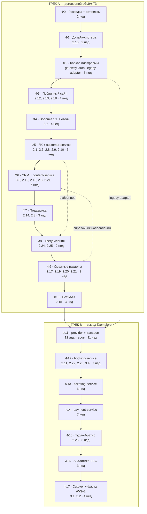

# DonBilet — Roadmap

**Версия:** 1.0 · **Дата:** 07.09.2026 · **Статус:** на согласовании
**Исполнитель:** соло-разработчик + Claude Code
**Договор:** №4063 от 10.08.2026, Приложение № 1

---

## 0. Как читать этот документ

| Документ | Что в нём |
|---|---|
| [tz.md](tz.md) | Текст ТЗ — 26 функциональных пунктов + 5 технических требований |
| [DonBilet — технологический стек и целевая архитектура.md](DonBilet%20—%20технологический%20стек%20и%20целевая%20архитектура.md) | Целевая архитектура: стек, 11 доменных сервисов, монорепо, план миграции |
| **roadmap.md** (этот файл) | Как из точки А попасть в точку Б: фазы, зависимости, оценки, приёмка |
| [../08-соответствие-ТЗ-Приложение-1.md](../08-соответствие-ТЗ-Приложение-1.md) | Что из ТЗ уже есть в legacy: ✅ 2 · 🟡 10 · ❌ 14 |
| [../01–07](../README.md) | Аудит legacy: стек, архитектура, API, данные, риски |
| `/Current.md` | Актуальное состояние проекта — обновляется каждую неделю |
| `/reports/phase-NN-*.md` | Отчёт по завершённой фазе — один файл на фазу целиком |

---

## 1. Зафиксированные решения

Приняты до составления roadmap, изменяются только через ADR.

| # | Решение | Источник |
|---|---|---|
| R1 | Целевой стек: Next.js 16 + NestJS + PostgreSQL/Prisma + Redis + Temporal + BullMQ + S3 + Traefik + Docker Compose | архитектура §3, §53 |
| R2 | iDempiere полностью выводится из эксплуатации после миграции | архитектура §53 |
| R3 | Два трека: **A — договорной объём ТЗ**, **B — вывод iDempiere**. Фичи, упирающиеся в booking/ticketing/payment, едут вместе со своим сервисом — ничего не пишем дважды | решение 07.09.2026 |
| R4 | Обратная совместимость мобильного API (ТЗ 3.2) обеспечивается **фасадом `/WSv2` в gateway** поверх новых сервисов, а не сохранением iDempiere | решение 07.09.2026 |
| R5 | Figma на публичный web и ЛК предоставляется заказчиком. CRM проектируем сами на shadcn/ui в токенах из п. 2.16 | решение 07.09.2026 |
| R6 | Исполнение: соло-разработчик + Claude Code. Фазы последовательные, параллелизм — внутри фазы через агентов | решение 07.09.2026 |
| R7 | Формат работы: `reports/phase-NN-*.md` — один отчёт на фазу целиком; `/Current.md` — актуальное состояние | решение 07.09.2026 |

### Уточнение к R3

В обсуждении трек B включал пункты 2.7, 2.15, 2.17–2.21. При детальной сверке они **не требуют** новых booking/ticketing/payment-сервисов:

| Пункт | Почему можно в трек A |
|---|---|
| 2.7 Отель на подтверждении | Партнёрский виджет на странице «билет куплен». Заказ не меняется |
| 2.15 Бот MAX | Диалог поверх готового API. Ходит в gateway → `legacy-adapter`, как и сайт |
| 2.17, 2.19, 2.20 Редизайн ЖД/Отели/Авиа | Обёртки над партнёрскими виджетами, чистый фронт |
| 2.21 Кросс-переход | Фронт + справочник направлений в `content-service` |

Остаются в треке B только те, что меняют состав и цену заказа: **2.11** (страховка как позиция заказа), **2.22** (отель как позиция заказа), **2.23** (промокод пересчитывает заказ на экране оплаты), **2.26** (два сегмента в одном заказе), **3.4** (единообразие форм заказа), **3.1** (консолидация модулей = факт удаления iDempiere).

Итог: **трек A закрывает 20 из 26 пунктов ТЗ**, трек B — оставшиеся 6 и технические требования.

---

## 2. Ключевой приём: `legacy-adapter`

Без него фронт нельзя выпустить раньше бэкенда, и roadmap разваливается.

```
                     apps/web (Next.js 16)
                     apps/crm (Next.js 16)
                              │
                              ▼
                          Traefik
                              │
                              ▼
                    ┌─────────────────────┐
                    │  gateway (NestJS)   │
                    │  auth, RBAC, OpenAPI│
                    │  единый формат ошибок│
                    └──────────┬──────────┘
                               │
              ┌────────────────┴────────────────┐
              ▼                                 ▼
   новые NestJS-сервисы              legacy-adapter
   (домен уже мигрирован)            (домен ещё в iDempiere)
   auth, customer, content,                    │
   support, notification                       ▼
                                    iDempiere /WSv2
                                    List<Map<String,Object>>
                                          │
                                          ▼
                                    нормализация в
                                    канонические DTO + zod
```

**Правила:**

1. Фронт **никогда** не знает, откуда пришли данные — контракт gateway один и тот же.
2. Переключение домена с `legacy-adapter` на новый сервис — feature flag, без изменений во фронте.
3. `legacy-adapter` **только читает и вызывает legacy**, собственной бизнес-логики не содержит.
4. Каждый метод адаптера покрыт golden-тестом из Ф0 — это гарантия, что нормализация не искажает данные.
5. Адаптер удаляется целиком в Ф17. Код, который в нём написан, — временный по определению и не должен разрастаться.

---

## 3. Карта фаз



| Трек | Фазы | Оценка | Что закрывает |
|---|---|---:|---|
| **A — договор** | Ф0–Ф10 | **35 недель ≈ 8 мес.** | 20 из 26 пунктов ТЗ, п. 3.3, п. 3.5 |
| **B — платформа** | Ф11–Ф17 | **41 неделя ≈ 9,5 мес.** | 6 оставшихся пунктов, п. 3.1, 3.2, 3.4 |
| **Итого** | Ф0–Ф17 | **76 недель ≈ 17–18 мес.** | ТЗ целиком + целевая архитектура |

> **Честная оценка.** 76 недель для одного человека — это полтора года. Оценки даны в рабочих неделях полной занятости, с учётом высокой доли кода, генерируемого агентами, но **без** учёта отпусков, простоев на согласованиях (по п. 6 ТЗ у заказчика до 3 рабочих дней на каждое согласование) и параллельной поддержки боевой системы.
>
> Рычаги сокращения — в разделе 7.

---

## 4. Формат работы

### 4.1. Отчёты по фазам

```
/reports/
  README.md              — как вести отчёты
  _TEMPLATE.md           — шаблон
  phase-00-discovery.md
  phase-01-design-system.md
  ...
```

Один файл на фазу целиком. Отчёт пишется **в конце фазы**, а не по подпунктам. Содержит: что сделано, что не сделано и почему, принятые решения, отклонения от плана, чеклист DoD, всплывшие риски, что нужно от заказчика.

### 4.2. `/Current.md`

Актуальное состояние проекта: текущая фаза, прогресс, активные блокеры, счётчик закрытых пунктов ТЗ, ссылки на последние отчёты. Обновляется еженедельно и при каждом изменении статуса блокера.

### 4.3. ADR

Архитектурные решения, отклоняющиеся от зафиксированных (раздел 1) или от целевой архитектуры, оформляются как ADR в `docs/adr/NNNN-<slug>.md`: контекст → варианты → решение → последствия. Без ADR отклонений не бывает.

### 4.4. Definition of Done фазы

Фаза закрыта, когда выполнены **все** пункты:

- [ ] Функциональность соответствует описанию пунктов ТЗ в объёме фазы (приёмка по п. 5.2 ТЗ — по каждому пункту отдельно)
- [ ] Код в основной ветке, CI зелёный
- [ ] Миграции Prisma применены на stage и prod
- [ ] Playwright-сценарии фазы проходят
- [ ] Golden/contract-тесты не сломаны
- [ ] `/health` и `/ready` у новых сервисов отвечают
- [ ] Выкачено на prod (или явно указано, почему нет)
- [ ] `reports/phase-NN-*.md` написан
- [ ] `/Current.md` обновлён

---

## 5. Роли: кто что делает

Исполнение — соло + Claude Code. «Кто» здесь — не люди, а полосы ответственности.

| Роль | Кто | Ответственность |
|---|---|---|
| **Техлид / архитектор** | человек | Архитектурные решения, ADR, ревью всего кода, доступы, согласования с заказчиком, приёмка фаз |
| **Агент «фронт»** | Claude Code | Next.js-страницы по Figma, `packages/ui`, формы, состояния, доступность |
| **Агент «бэк»** | Claude Code | NestJS-сервисы, Prisma-схемы и миграции, DTO, OpenAPI |
| **Агент «интеграции»** | Claude Code | Адаптеры перевозчиков по фикстурам, `legacy-adapter`, нормализация |
| **Агент «QA»** | Claude Code | Playwright-сценарии, golden-тесты, contract-тесты провайдеров |
| **Агент «легаси»** | Claude Code | Чтение Java-кода, извлечение бизнес-правил в спецификации, хотфиксы в iDempiere |

### Что не делегируется агентам

Проверяется человеком построчно, без исключений:

- Платёжный контур: подписи вебхуков, идемпотентность, суммы, возвраты, фискализация 54-ФЗ
- Правила удержаний при возврате (шкала 0/5/15/25/100 %) — цена ошибки измеряется в деньгах клиентов
- Обработка PII: документы пассажиров, даты рождения, телефоны
- Миграции данных с боевого дампа
- Всё, что пишет в `AD_User` / `sib_order` / `sib_tickets` в legacy
- RBAC и права в CRM

---

# ТРЕК A — договорной объём

## Ф0. Разведка, фиксация фактов, безопасность

**Оценка:** 2 недели · **Пункты ТЗ:** подготовка к 2.20 · **Блокер:** доступы от заказчика

### Цель
Убрать неизвестность из всех последующих фаз и закрыть уязвимости, которые нельзя оставлять на 18 месяцев.

### Задачи

**1. Доступы и артефакты**
- Дамп боевой БД iDempiere (со словарём AD)
- Фактический `rest-context.xml` с прода — в архиве 11 из 22 ресурсов не зарегистрированы, на проде может быть иначе
- Содержимое `sib_c_barnaul_config` (ключи, URL, SMTP)
- Credentials 12 перевозчиков и 4 платёжных шлюзов
- Доступ к хостингу, DNS, Яндекс.Метрике, Search Console
- Figma на web и ЛК

**2. Golden-тесты legacy API** — фундамент Ф4 и Ф17
- Запись реальных пар запрос/ответ `/WSv2` для **сайта** и **мобильного приложения**
- Прокси-запись на проде либо воспроизведение по логам
- Фикстуры в `packages/contracts/fixtures/legacy/`
- Покрыть обязательно: `search`, `details`, `start/ticket`, `reserve/addpass`, `reserve/getpass`, `reserve/buy`, `reserve/result`, `main/getticket`, `lk/*`, `authenticate/login`

**3. Восстановление legacy data model** (архитектура §49, этап 2)
- Маппинг 57 таблиц `sib_*` → целевые схемы: `sib_order → booking.orders`, `sib_tickets → ticketing.tickets`, `sib_schedule → transport.trips`, и далее
- Выяснить смысл перегруженных полей: `order.Description` = session_id платежа, `order.Help` = префикс номера, `order.Name` = номер заказа
- Документ `docs/migration/data-map.md`

**4. Аудит раздела Авиа** — требование п. 2.20 ТЗ
- Где живёт `donbilet.ru/avia`, чей код, доступен ли исходник, что можно менять
- Без этого объём п. 2.20 не определяется

**5. Аудит партнёрских виджетов**
- ЖД: `tripandfly.ru/embedded-portal` (`wl-embedded-portal partnerId="donbilet_wl"`) — какая кастомизация возможна
- Отели: `hotels.donbilet.ru/static/dist/js/affiliate-search.js` — параметризация города и дат
- Ответ определяет реальный объём 2.17, 2.19, 2.7, 2.22

**6. Хотфиксы безопасности в legacy** — выкатываются немедленно

| Что | Где |
|---|---|
| SQL-инъекция через `apikey` | `MSIBFrontendAPI.getAPIId()` — параметризовать запрос |
| Ротация секретов | `apitoken` (лежит в git), ключи Payler, SMTP-пароль |
| Подпись + идемпотентность платёжного callback | `ReserveResource.checkMerchant` |
| Отладочная отправка каждого билета на `vladislav@siberium.ru` | `MainResource.java:299` |
| Проверить публичность CRUD-эндпоинта ERP | `/DBInterface/services/rest` |
| Проверить значение `USER_PASSWORD_HASH` | боевая БД — если выключен, пароли лежат открытым текстом |

**7. Инфраструктура**
- Монорепо по §44: `apps/`, `backend/`, `workers/`, `integrations/`, `packages/`, `deploy/`
- Bun workspaces, TypeScript, ESLint, Prettier
- Docker Compose: traefik, postgres, redis
- CI: lint + typecheck + test
- Окружения: dev (локально), stage, prod

**8. ADR-0001…N** по решениям R1–R7

### DoD
- [ ] Golden-тесты записаны и проходят на текущем проде
- [ ] Все 6 хотфиксов выкачены и проверены
- [ ] `docs/migration/data-map.md` согласован
- [ ] Отчёт по аудиту Авиа и виджетов — с выводом об объёме 2.17, 2.19, 2.20
- [ ] `docker compose up` поднимает окружение одной командой
- [ ] Figma получен

### Риски
| Риск | Митигация |
|---|---|
| Доступы задерживаются → стоит весь проект | Начать с п. 7 (инфраструктура), не требующего доступов. Эскалировать по п. 6 ТЗ (3 рабочих дня) |
| Хотфикс в Java ломает прод | Каждый фикс отдельным релизом, откат подготовлен заранее |
| Раздел Авиа окажется чужим продуктом | Тогда п. 2.20 переоформляется допсоглашением |

---

## Ф1. Дизайн-система и брендинг

**Оценка:** 2 недели · **Пункты ТЗ:** 2.16 (полностью), основа для 2.17–2.20, 3.5

### Цель
Превратить Figma в работающий `packages/ui`, покрывающий и web, и CRM.

### Задачи
- Извлечь из Figma токены: палитра с HEX, типографическая шкала, spacing, радиусы, тени, брейкпоинты → тема Tailwind v4 в `packages/ui`
- Логотип: основной, монохромный, для тёмного фона (п. 2.16). Если в Figma нет — рисуем
- Примитивы на shadcn/ui + компоненты DonBilet поверх: кнопки (обычная / наведение / фокус / неактивная / загрузка), поля ввода, селекты, переключатели, чекбоксы, радио, карточки, попапы, тосты, табы, аккордеон, пагинация, календарь
- **CRM-кит** проектируем сами (R5): таблицы с сортировкой и фильтрами, формы, боковая навигация, тулбар, состояния пустоты и загрузки, подтверждающие диалоги
- Витрина компонентов (страница `/__ui` в dev-сборке или Storybook)
- `DESIGN.md`: правила использования, что можно и чего нельзя

### DoD
- [ ] `packages/ui` собирается, типы экспортируются
- [ ] Все состояния каждого компонента видны на витрине
- [ ] Тёмная тема поддержана либо явно признана вне объёма
- [ ] Доступность: фокус-кольца, контраст ≥ 4.5:1, aria-атрибуты у интерактивных элементов
- [ ] `DESIGN.md` написан

### Риски
| Риск | Митигация |
|---|---|
| Figma неполон — нет состояний компонентов | Достраиваем сами по логике макета, фиксируем в `DESIGN.md`, согласуем скриншотами |
| CRM-кит расходится с web-китом | Один источник токенов, CRM отличается только плотностью и композицией |

---

## Ф2. Каркас платформы

**Оценка:** 3 недели · **Пункты ТЗ:** инфраструктура для всех

### Цель
Поднять gateway, auth и `legacy-adapter` — после этой фазы фронт может ехать вперёд, не дожидаясь миграции доменов.

### Задачи

**gateway (NestJS)**
- Маршрутизация `/api/v1/*`, версионирование
- `requestId` / `correlationId` сквозь весь стек
- Единый формат ошибок (§36): `{ error: { code, message, requestId } }`
- Rate limiting на Redis
- Валидация публичных запросов через zod
- OpenAPI-спека генерируется автоматически

**`legacy-adapter`**
- Типизированный HTTP-клиент к `/WSv2`
- Нормализация `List<Map<String,Object>>` → канонические DTO с zod-валидацией на границе
- Пул соединений, таймауты, retry с экспоненциальной задержкой, circuit breaker
- Каждый метод покрыт golden-тестом из Ф0

**`auth-service`**
- Email/password, **Argon2id**
- Сессии, access token короткоживущий, refresh в HttpOnly/Secure/SameSite cookie
- RBAC-модель для CRM (роли и permissions по §32) — используется с Ф6
- **Миграция паролей без участия пользователя:** при входе сначала проверяем по legacy-правилу (открытый текст или хеш iDempiere), при успехе немедленно пересчитываем в Argon2id и помечаем запись. Legacy-ветка удаляется в Ф17
- Rate limiting попыток входа

**Общие пакеты**
- `packages/contracts` — OpenAPI + zod-схемы, общие для фронта и бэка
- `packages/observability` — Pino structured logs, `/health`, `/ready`, фильтр секретов в логах (§33: пароли, токены, OTP, паспортные данные, платёжные payload'ы не логируются)
- `packages/shared` — только технические примитивы (§45), бизнес-логика запрещена

**Данные и инфраструктура**
- PostgreSQL: схемы `auth`, `customers`, `content`, `support`, `notifications` (создаются по мере фаз)
- Prisma, первые миграции
- Redis
- Traefik: path-based split `donbilet.ru` между новым Next.js и старым Angular — механизм постепенного выката

### DoD
- [ ] Логин работает на боевых legacy-пользователях, пароль тихо мигрирует в Argon2id
- [ ] `legacy-adapter` проходит все golden-тесты Ф0
- [ ] Gateway отдаёт валидный OpenAPI
- [ ] Split-роутинг работает на stage: часть маршрутов на Next.js, часть на Angular
- [ ] Secret-фильтр в логах проверен негативным тестом
- [ ] `/health`, `/ready` у gateway и auth-service

### Риски
| Риск | Митигация |
|---|---|
| `USER_PASSWORD_HASH` выключен → пароли в открытом виде | Обнаруживается в Ф0. Миграция всё равно работает, но требует форс-сброса при первом входе для части пользователей |
| Формат ответов legacy плавает между эндпоинтами | Golden-тесты Ф0 фиксируют реальность; расхождения — в отчёт |
| Split-роутинг ломает SSR/SEO | Проверка на stage с реальным краулером до выката |

---

## Ф3. Публичный сайт

**Оценка:** 4 недели · **Пункты ТЗ:** 2.12 (публичная часть), 2.13 (публичная часть), 2.18 (витрина Авто)

### Цель
Перенести публичную, SEO-значимую часть сайта на Next.js без потери позиций в поиске.

### Задачи
- `apps/web`: Next.js 16 App Router, layout, шапка, подвал, навигация
- Страницы: главная с формой поиска, результаты поиска, детали рейса, расписания `/raspisanie`, направления `/raspisanie/:slug`, FAQ, новости (список + карточка), о нас, контакты, обратная связь, b2b, партнёрская форма, оферта, политика, страховка (информационная), статические лендинги `/rostov_moskva`, `/krim`
- Данные: gateway → `legacy-adapter`
- **SEO — критический блок:**
  - Полная карта URL старого сайта → новый, редиректы 301 на всё, что меняется
  - `sitemap.xml`, `robots.txt`, канонические URL
  - Метатеги и Open Graph (перенести логику `MetaService`)
  - Структурированные данные для страниц направлений
  - Проверка краулером до выката, мониторинг Search Console 2 недели после
- Яндекс.Метрика, счётчики
- Выкат: Traefik переключает маршруты по одному, канареечно

### DoD
- [ ] Все URL старого сайта отвечают 200 или 301, ни одного 404
- [ ] Core Web Vitals не хуже старого сайта
- [ ] Мониторинг Search Console 2 недели: трафик не просел
- [ ] Пп. 2.12 и 2.13 в публичной части приняты (админка — Ф6)
- [ ] Мобильная вёрстка проверена на реальных устройствах

### Риски
| Риск | Митигация |
|---|---|
| **Потеря SEO-трафика** — главный риск фазы | Полная карта редиректов, канареечный выкат, откат за один переключатель Traefik, ежедневный мониторинг |
| Старый сайт имеет незадокументированные URL | Собрать реальный список из логов веб-сервера и Search Console в Ф0 |

---

## Ф4. Воронка покупки — перенос 1:1

**Оценка:** 4 недели · **Пункты ТЗ:** 2.18 (воронка), 2.7 (отель на подтверждении)

### Цель
Перенести на новый фронт воронку покупки **без изменения бизнес-логики**. Это фаза с наибольшим риском для выручки.

### Задачи
- Экраны: выбор рейса → схема мест → данные пассажиров → доп. услуги → оплата → страница результата
- Второй сценарий (бронь без оплаты) переносится тем же кодом — архитектурная подготовка к п. 3.4
- Данные: gateway → `legacy-adapter`
- **Никаких новых фич.** Страховка (2.11), промокоды на экране оплаты (2.23), отель как позиция заказа (2.22) — в Ф12. Иначе пишем дважды
- **2.7 Отель на подтверждении:** блок на странице «билет куплен» с виджетом партнёра, автоподстановка города прибытия и дат — не меняет заказ, поэтому здесь
- Состояние воронки: сейчас размазано по 15 query-параметрам, cookies и sessionStorage. Переводим в единый серверный booking-контекст в Redis + минимум в URL
- Приёмка golden-тестами из Ф0

### DoD
- [ ] Все golden-тесты воронки зелёные
- [ ] Канареечный выкат 10 % трафика на неделю: конверсия не хуже старой
- [ ] Playwright: `поиск → бронирование → оплата → билет` на тестовом платёжном контуре
- [ ] Откат в один переключатель Traefik проверен на stage
- [ ] Оба сценария (покупка и бронь) работают
- [ ] П. 2.7 принят

### Риски
| Риск | Митигация |
|---|---|
| **Падение конверсии = прямая потеря выручки** | Канареечный выкат с посуточным сравнением конверсии, автоматический откат при просадке > 5 % |
| Скрытая логика в 551 строке `booking.component.ts` | Агент «легаси» извлекает бизнес-правила в спецификацию до начала переписывания |
| Расхождение поведения при ошибках 402/408/422/423 | Golden-тесты покрывают негативные сценарии, не только happy path |

---

## Ф5. Личный кабинет + customer-service

**Оценка:** 5 недель · **Пункты ТЗ:** 2.1, 2.2, 2.3, 2.4, 2.5, 2.6, 2.8 (пользовательская часть), 2.9, 2.10 · **Ядро договора**

### Цель
Первый собственный доменный сервис и весь ЛК из ТЗ.

### Задачи

**`customer-service`** — сущности: `Customer`, `Passenger`, `FavoriteDirection`, `FavoriteTrip`, `TripHistory`, `CarrierRating`, `Message`

**Миграция данных:** `SIB_C_LKSubscriber` / `AD_User` → `customers.customer`. Сверка по количеству и выборочно по записям.

**Пункты ТЗ:**

| Пункт | Что делаем | Замечание |
|---|---|---|
| 2.1 Мои билеты | Список, детали, PDF, возврат с кодом, скрытие | Билеты читаются через `legacy-adapter`. **Фикс: проверка принадлежности PDF по сессии** — сейчас у оплаченного заказа PDF отдаётся любому, кто знает `ticketid`. Скрыть «Вернуть билет» для прошедших рейсов, добавить попап «Вы уверены?» |
| 2.2 История | Список, «Повторить поездку», скрытие | Логика есть в legacy, переносим |
| 2.3 Сообщения | **Новая схема:** `is_read`, `created_at`, `type`, `payload` | В `sib_messages` этих полей нет физически. Автоисточник — статус возврата; ручной — из CRM (Ф6) |
| 2.4 Профиль | Email только чтение, телефон и пароль | Сверка пароль/повтор на бэкенде, не только на фронте |
| 2.5 Избранное | Направления и билеты, «сердце» на поиске и карточке рейса, правило устаревания | Полностью с нуля |
| 2.6 Пассажиры | До 10 записей, валидация по типу документа, выбор при оформлении | Полностью с нуля. **Документы — PII, шифруем на уровне приложения** (§33) |
| 2.8 Оценка | 5 звёзд, проверка принадлежности билета, «Спасибо за оценку» вместо блока | Админка и CSV — Ф6 |
| 2.9 VK ID / Яндекс ID | OAuth в `auth-service`, связка по email, форма ввода email если провайдер не отдал | Полностью с нуля |
| 2.10 Подтверждение email | **TTL кода 15 минут**, **rate limit 60 секунд**, `SecureRandom`, уведомление в ЛК о неподтверждённом email | В legacy: эндпоинт не зарегистрирован, проверка закомментирована, TTL и rate limit отсутствуют |

### DoD
- [ ] Каждый из 9 пунктов принят отдельно по описанию ТЗ (п. 5.2)
- [ ] Миграция пользователей сверена: количество совпадает, выборка из 50 записей проверена вручную
- [ ] PDF билета недоступен по чужому `ticketid` — негативный тест
- [ ] Документы пассажиров зашифрованы в БД, в логах не появляются
- [ ] Rate limit кода подтверждения проверен нагрузочно
- [ ] Playwright: регистрация → подтверждение → вход → ЛК → возврат билета

### Риски
| Риск | Митигация |
|---|---|
| Миграция пользователей теряет или дублирует записи | Сверка на stage-копии боевого дампа до прод-миграции, идемпотентный скрипт |
| VK ID / Яндекс ID требуют модерации приложения у провайдера | Подать заявки в начале Ф5, не в конце |
| PII-утечка через логи | Фильтр секретов из Ф2 + негативный тест на каждое поле |

---

## Ф6. CRM + content-service

**Оценка:** 5 недель · **Пункты ТЗ:** 3.3, 2.12 (админка + RSS), 2.13 (админка), 2.8 (админка + CSV), 2.21 (справочник), 2.3 (источник событий)

### Цель
Отдельная панель администрирования для нетехнического персонала — п. 3.3 ТЗ прямо запрещает использовать техническую консоль платформы.

### Задачи

**`apps/crm`** — Next.js, дизайн-кит из Ф1
- Аутентификация сотрудников, RBAC по §32: SuperAdmin, Administrator, Support, OrderManager, RefundManager, ContentManager, Marketing, Finance, Analyst, Technical
- **Audit log** по §34: actor, action, entity, entity_id, before, after, ip, user_agent, timestamp
- Разделы этой фазы: **Контент**, **Настройки** (Сотрудники, Роли, Audit Log), **Клиенты** (чтение через customer-service), **Оценки**

**`content-service`** — `Page`, `News`, `FaqCategory`, `Faq`, `Banner`, `SeoPage`, `Redirect`, `LegalDocument`, `AirDirection`
- Редактор TipTap, файлы в S3
- Миграция контента из `sib_news`, `sib_webfaq`, `sib_webabout`, `sib_banners`

**Пункты ТЗ:**
- **2.12** — админка новостей (создать/редактировать/удалить/скрыть, отложенная публикация будущей датой), пагинация публичного списка, **RSS-фид в формате Дзена** по отдельному техническому адресу
- **2.13** — админка FAQ: категории, порядок отображения, CRUD
- **2.8** — таблица оценок, фильтры по перевозчику/маршруту/периоду, выгрузка CSV
- **2.21** — справочник направлений с подтверждённым авиасообщением: список пар городов с переключателем вкл/выкл (показ блока — Ф9)
- **2.3** — экран «Уведомление о рейсе»: сотрудник отмечает рейс отменённым/перенесённым, создаётся сообщение пользователям. Полноценный раздел «Перевозки» — Ф11

### DoD
- [ ] Контент-менеджер публикует новость и правит FAQ без разработчика — проверено на реальном сотруднике заказчика
- [ ] RSS проходит валидацию Дзена
- [ ] CSV с оценками открывается в Excel, кириллица не побита
- [ ] Audit log пишется на все критичные действия из §34
- [ ] Права проверены: пользователь роли ContentManager не видит платежи
- [ ] Контент из legacy мигрирован, старые URL новостей работают

### Риски
| Риск | Митигация |
|---|---|
| Требования Дзена к RSS формальны и строги | Валидировать против реального сервиса на раннем этапе фазы |
| Заказчик привык к консоли iDempiere | Демонстрация и обучение до сдачи фазы, короткая инструкция |

---

## Ф7. Поддержка

**Оценка:** 3 недели · **Пункты ТЗ:** 2.14 (полностью), 2.3 (автоматический источник)

### Цель
Чат реального времени и рабочее место оператора.

### Задачи
- `support-service`: `Conversation`, `Message`, `Attachment`, назначение оператора, статусы
- WebSocket, вложения в S3
- Виджет на web и в ЛК: плавающая иконка на всех страницах; неавторизованный — обязательное поле телефона перед первым сообщением; авторизованный — контакты из аккаунта
- CRM: раздел «Поддержка» — список обращений (открытые/закрытые), окно диалога, поле ответа, «Закрыть обращение»
- Замыкание п. 2.3: автоматическое сообщение при подтверждении/отклонении возврата

### DoD
- [ ] Сообщение оператора доходит до клиента менее чем за 1 секунду
- [ ] История сохраняется, переподключение после обрыва восстанавливает диалог
- [ ] Вложения загружаются и скачиваются
- [ ] Одновременная работа нескольких операторов не приводит к дублям ответов
- [ ] П. 2.14 принят

### Риски
| Риск | Митигация |
|---|---|
| WebSocket через Traefik и SSR | Проверить конфигурацию Traefik для ws в начале фазы |
| Нагрузка на операторов не оценена | Согласовать с заказчиком график работы поддержки и поведение вне рабочих часов |

---

## Ф8. Уведомления

**Оценка:** 2 недели · **Пункты ТЗ:** 2.24, 2.25

### Цель
Единая точка исходящих коммуникаций и две фоновые рассылки из ТЗ.

### Задачи
- `notification-service`: шаблоны, каналы Email/SMS, BullMQ, retry, статусы доставки
- Перенос текущих рассылок: PDF билета на почту, коды подтверждения
- **SMS-канал реализуется по-настоящему** — в legacy `SMSSender` заглушка на 14 строк
- **2.24** — фоновая проверка цен по избранным билетам (Ф5), письмо «Цена на ваш билет снизилась» с деталями рейса и ссылкой
- **2.25** — напоминание за N часов до отправления, **интервал настраивается в CRM**: маршрут, дата и время, место, станция, «что взять с собой»
- CRM: просмотр статусов доставки

### DoD
- [ ] Письма доходят, статусы видны в CRM
- [ ] Интервал напоминания меняется в CRM без деплоя
- [ ] Retry работает: имитация недоступности SMTP не теряет письмо
- [ ] Пп. 2.24 и 2.25 приняты

### Риски
| Риск | Митигация |
|---|---|
| Письма попадают в спам | SPF/DKIM/DMARC настроить в этой фазе, прогреть домен |
| Проверка цен по избранному нагружает API перевозчиков | Батчинг, кеш в Redis, ограничение частоты |

---

## Ф9. Смежные разделы и кросс-переходы

**Оценка:** 2 недели · **Пункты ТЗ:** 2.17, 2.19, 2.20, 2.21 (показ)

### Цель
Привести разделы-обёртки к новой айдентике в пределах возможного и включить кросс-переходы.

### Задачи
- **2.17 ЖД** — обёртка вокруг виджета tripandfly в новом дизайне. Объём кастомизации самого виджета определён в Ф0
- **2.19 Отели** — обёртка вокруг партнёрского виджета. Убрать инъекцию CSS в `document.head` из компонента, привести к нормальной кастомизации
- **2.20 Авиа** — по результатам аудита Ф0. Если раздел чужой — оформляется допсоглашением
- **2.21** — карточка «Посмотрите также рейсы ЖД/Авиа в этом направлении» после списка результатов, переход с предзаполненными городами. Авиа-блок показывается только для направлений из справочника Ф6

### DoD
- [ ] Разделы визуально консистентны с сайтом в пределах, установленных аудитом Ф0
- [ ] Ограничения кастомизации виджетов зафиксированы письменно и согласованы
- [ ] Кросс-переход передаёт города корректно
- [ ] Пп. 2.17, 2.19, 2.21 приняты; 2.20 — принят или переоформлен

### Риски
| Риск | Митигация |
|---|---|
| Виджеты не кастомизируются под UI-кит | Зафиксировано в Ф0. Согласовать с заказчиком достижимый результат заранее, чтобы не спорить на приёмке |

---

## Ф10. Бот в мессенджере MAX

**Оценка:** 3 недели · **Пункты ТЗ:** 2.15

### Цель
Отдельный входной канал поверх готового API. Бизнес-логики в боте нет (§30).

### Задачи
- `integrations/max`: адаптер платформы, машина состояний диалога
- Сценарий по ТЗ: приветствие → город отправления → город прибытия → дата → список рейсов → выбор → **список мест кнопками** (графическая схема вне объёма, п. 4.6) → данные пассажира пошагово или выбор сохранённого (2.6) → сумма → оплата → PDF в диалог
- Оплата: нативный механизм MAX при наличии, иначе ссылка на ту же страницу оплаты сайта — без повторного ввода платёжных данных
- Связка аккаунта MAX с аккаунтом DonBilet — для «Мои билеты» и сохранённых пассажиров

### DoD
- [ ] Полный сценарий покупки в диалоге проходит на тестовом платёжном контуре
- [ ] PDF приходит файлом
- [ ] Обрыв диалога и возврат в него не теряют состояние
- [ ] П. 2.15 принят

### Риски
| Риск | Митигация |
|---|---|
| Возможности платформы MAX неизвестны | Изучить API и наличие нативных платежей в начале фазы; ТЗ допускает оба варианта оплаты |
| Модерация бота у платформы | Подать на модерацию в начале фазы |

---

> ## 🏁 Конец трека A
>
> **Закрыто 20 из 26 пунктов ТЗ**, плюс пп. 3.3 и 3.5.
> Не закрыто: **2.11** страховка, **2.22** отель в заказе, **2.23** промокоды полностью, **2.26** туда-обратно, **3.1** консолидация модулей, **3.4** единообразие форм заказа — все упираются в собственные booking/ticketing/payment-сервисы.
>
> Это естественная точка промежуточной сдачи и пересмотра приоритетов.

---

# ТРЕК B — вывод iDempiere

## Ф11. provider-service + transport-service

**Оценка:** 11 недель · **Самая объёмная фаза проекта**

### Цель
Перенести 12 интеграций с перевозчиками и весь транспортный каталог. После этой фазы поиск перестаёт зависеть от iDempiere.

### Задачи

**`provider-service`** (§11–12)
- Единый интерфейс `TransportProvider`: `searchTrips`, `getTrip`, `getSeats`, `reserve`, `cancelReservation`, `issueTicket`, `refundTicket`
- Каноническая модель: `Provider`, `Carrier`, `City`, `Station`, `Route`, `RouteStop`, `Trip`, `Fare`, `Seat`, `SeatMap`, `Reservation`, `ProviderTicket`, `ProviderRefund`
- 12 адаптеров: donbilet (собственная касса, протокол `RSRV`/`EXCL`), busfor, avibus, avibus-pro, avibus-astra, avibus-novomeh, regionbilet (v2), yahont, etrafik, biletik, busroute, kras
- **Contract-тесты по фикстурам** (§40): запись реальных ответов каждого перевозчика → адаптер → канонический `Trip` → snapshot. Изменение API одного перевозчика не ломает всю систему
- Четыре пакета AviBus в legacy — копии друг друга; в новой реализации это один адаптер с конфигурацией

**`transport-service`** (§10)
- Города, станции, маршруты, остановки, перевозчики, расписания, рейсы, тарифы, схемы мест, доступность, поиск, популярные направления
- Поиск живёт здесь, отдельного `search-service` нет (§53)
- Маппинги идентификаторов перевозчиков (замена `sib_db_stationinapi`, `sib_cityinapi`, `sib_route_stops_inapi`, `sib_doctypesinapi`)
- Кеш ответов провайдеров в Redis

**Workers** — замена 37 процессов `SvrProcess`
- `provider-sync-worker` на BullMQ: загрузка расписаний по каждому перевозчику, связывание направлений, обновление справочников, health-check провайдеров

**Переключение**
- Feature flag: поиск идёт в `transport-service` вместо `legacy-adapter`
- Теневой режим: обе реализации выполняются параллельно, результаты сравниваются, расхождения логируются. Переключение — только когда расхождений нет

**CRM:** раздел «Перевозки» — Рейсы, Маршруты, Города, Станции, Перевозчики, API-провайдеры

### DoD
- [ ] Все 12 адаптеров проходят contract-тесты
- [ ] Теневой режим неделю: результаты поиска совпадают с legacy
- [ ] Синхронизация расписаний работает по всем перевозчикам
- [ ] Раздел «Перевозки» в CRM закрывает задачи, ранее решавшиеся в консоли iDempiere
- [ ] Поиск переключён на `transport-service` на проде

### Риски
| Риск | Митигация |
|---|---|
| Недокументированные особенности API перевозчиков | Фикстуры с боевых ответов, а не по документации. Агент «легаси» извлекает правила из 14 000 строк SDK |
| Перевозчик меняет API во время миграции | Contract-тесты обнаружат немедленно |
| Расхождения в результатах поиска = потеря продаж | Теневой режим до переключения, посегментное сравнение |
| **Фаза очень длинная — риск потери темпа** | Разбить на подпоставки по перевозчикам: адаптер + тесты + переключение по одному API |

---

## Ф12. booking-service

**Оценка:** 7 недель · **Пункты ТЗ:** 2.11, 2.22, 2.23 (полностью), 3.4

### Цель
Собственное оформление заказа и все фичи, меняющие состав и цену заказа.

### Задачи
- `booking-service` (§13): `Booking`, `Order`, `OrderItem`, `Reservation`, `BookingPassenger`, `PromoApplication`, `AdditionalService`
- Состояния: `CREATED → RESERVING → RESERVED → WAITING_PAYMENT → PAID → ISSUING → COMPLETED`, плюс `CANCELLED`, `FAILED`, `REFUNDING`, `REFUNDED`
- **Temporal `BookingWorkflow`** (§21.1) с компенсацией: оплата прошла, выдача билета не удалась → retry → возврат денег → освобождение брони → уведомление
- Идемпотентность: `Idempotency-Key` на создание бронирования (§37)
- **3.4** — единый шаг оформления заказа для всех сценариев. Сейчас их два с разной логикой
- **2.11 Страховка** — отдельный шаг между данными пассажиров и оплатой, во всех сценариях. Переключатель с явным состоянием по умолчанию, сумма прибавляется к итогу
- **2.22 Отель** — позиция заказа: блок в результатах поиска, отдельная строка на экране оплаты с возможностью убрать, оплата в общем платеже, документ по услуге отдельно
- **2.23 Промокоды полностью** — применение **на экране оплаты**, срок действия, **лимит использований со счётчиком**, сообщения об ошибках («не найден» / «срок истёк» / «уже использован»), автодеактивация одноразовых. Админка в CRM: список, форма создания с автогенерацией, «Деактивировать»
- Миграция: `sib_order` → `booking.orders`
- CRM: разделы «Заказы», «Маркетинг → Промокоды»

### DoD
- [ ] Пп. 2.11, 2.22, 2.23, 3.4 приняты
- [ ] Компенсация `BookingWorkflow` проверена: имитация сбоя выдачи приводит к возврату денег
- [ ] Повторный запрос с тем же `Idempotency-Key` не создаёт второй заказ
- [ ] Промокод с исчерпанным лимитом отклоняется
- [ ] Миграция заказов сверена по суммам и количеству

### Риски
| Риск | Митигация |
|---|---|
| Правила ценообразования в 4 279 строках `ReserveService` | Агент «легаси» извлекает правила в спецификацию; unit-тесты на pricing до реализации; сверка расчётов с legacy на боевых данных |
| Двойное бронирование при сбое | Temporal + идемпотентность |
| Логика купона в legacy частично отключена (`length() > 100000`) | Реализуем по ТЗ, а не по legacy. Расхождение зафиксировать в отчёте |

---

## Ф13. ticketing-service

**Оценка:** 6 недель

### Цель
Жизненный цикл билета и бизнес-возврат.

### Задачи
- `ticketing-service` (§14): `Ticket`, `TicketPassenger`, `TicketDocument`, `TicketRefund`, `TicketRefundRule`, `TicketFile`
- Выдача, статусы, история, генерация PDF, хранение в S3
- **Правила возврата** — перенос шкалы удержаний: 0 % при отмене рейса перевозчиком или оплате менее 10 минут назад, 5 % при более 2 часов до отправления, 15 % при 30 минут–2 часа, 25 % от −30 минут до +3 часов, 100 % позже. **Правила — в БД, а не в коде**, чтобы менялись без деплоя
- **Temporal `RefundWorkflow`** (§21.2): валидация → расчёт → возврат билета перевозчику → возврат денег → фискальный возврат → обновление билета → уведомление
- Исправление legacy-бага: `SimpleDateFormat("...hh:mm:ss...")` — 12-часовой формат при разборе времени отправления
- Миграция: `sib_tickets` → `ticketing.tickets`
- CRM: разделы «Билеты», «Возвраты» с ролью RefundManager

### DoD
- [ ] Расчёт удержаний совпадает с legacy на выборке из 200 боевых возвратов
- [ ] PDF генерируется и доступен только владельцу
- [ ] `RefundWorkflow` восстанавливается после перезапуска сервера
- [ ] Правила удержаний меняются в CRM без деплоя
- [ ] Миграция билетов сверена

### Риски
| Риск | Митигация |
|---|---|
| **Ошибка в расчёте возврата = деньги клиентов** | Сверка на 200 боевых кейсах, ручная проверка человеком, не агентом |
| PDF-шаблон в отчётах iDempiere | Воспроизвести макет билета заново, согласовать с заказчиком до реализации |

---

## Ф14. payment-service

**Оценка:** 7 недель · **Самая рискованная фаза**

### Цель
Перенести платёжный контур с фискализацией.

### Задачи
- `payment-service` (§15): единый `PaymentProvider` интерфейс, адаптеры Сбер, СберNew, Альфа, Payler
- **Требования §16 — обязательны:** идемпотентность, проверка подписи, дедупликация вебхуков по `provider_event_id`, безопасный retry, audit log. Повторный вебхук не меняет заказ, не выдаёт билет, не делает возврат, не отправляет чек
- Фискализация 54-ФЗ: чеки прихода и возврата
- Сверка платежей (reconciliation)
- Маршрутизация шлюзов — вместо legacy-логики «берём последний активный ID» делаем явную конфигурацию с приоритетами и фолбэком
- Секреты: environment variables / Docker secrets, **не в таблице БД** (§33)
- Миграция: `sib_payments` → `payments.payments`
- CRM: раздел «Платежи», роль Finance

### DoD
- [ ] Все 4 шлюза работают на тестовом контуре
- [ ] Повторная отправка вебхука не приводит к двойному действию — проверено на каждом шлюзе
- [ ] Подпись вебхука проверяется, поддельный отклоняется
- [ ] Чеки уходят в ОФД, возвратные чеки формируются
- [ ] Сверка за сутки сходится
- [ ] **Ручная проверка человеком всего платёжного кода построчно**
- [ ] Пилот на 5 % трафика неделю без расхождений

### Риски
| Риск | Митигация |
|---|---|
| **Потеря или задвоение платежей** | Идемпотентность на всех уровнях, пилот на малом трафике, ежедневная сверка, откат подготовлен |
| Нарушение 54-ФЗ | Сверка с бухгалтерией заказчика до выката, тестовая касса |
| Расхождение с боевым поведением шлюзов | Записать реальные вебхуки в Ф0, использовать как фикстуры |

---

## Ф15. Билет «туда-обратно»

**Оценка:** 3 недели · **Пункты ТЗ:** 2.26

### Цель
Единая покупка двух прямых рейсов поверх двух самостоятельных бронирований.

### Задачи
- Переключатель «В одну сторону» / «Туда-обратно», поле «Дата обратного рейса» с минимальной датой не раньше рейса «туда»
- Результаты: рейс «туда» + подборка «обратно»
- Данные пассажиров вводятся один раз, применяются к обоим сегментам
- Единый экран оплаты, единая сумма, единый номер заказа для пользователя
- **Согласованное управление сроком действия обеих броней**
- **Компенсация по ТЗ:** не удалось забронировать второй сегмент → первый автоматически отменяется, сообщение «Не удалось забронировать обратный рейс, попробуйте другую дату», **списания не происходит** — реализуется как `BookingWorkflow` с двумя сегментами

### DoD
- [ ] П. 2.26 принят
- [ ] Имитация сбоя второго сегмента: первый отменён, денег не списано, сообщение показано
- [ ] Оба сегмента возвращаются независимо
- [ ] Разные перевозчики на сегментах работают

### Риски
| Риск | Митигация |
|---|---|
| Разные TTL брони у перевозчиков | Срок действия заказа = минимум из двух; предупреждение пользователю |
| Гонка при параллельном бронировании | Строгая последовательность в workflow, не параллельно |

---

## Ф16. Аналитика и 1С

**Оценка:** 3 недели

### Задачи
- `analytics-service` (§20) на PostgreSQL, без ClickHouse: выручка, заказы, билеты, возвраты, средний чек, конверсия, success rate платежей, error rate провайдеров, популярные маршруты, клиенты, повторные покупки
- CRM: раздел «Аналитика», Dashboard
- `integrations/1c` (§31): события `order completed`, `payment received`, `refund completed`, `fiscal operation`, бухгалтерские документы. Односторонняя выгрузка — поиск, бронирование и работа с пассажирами через 1С запрещены

### DoD
- [ ] Метрики сходятся с выгрузкой из legacy за тот же период
- [ ] Выгрузка в 1С принята бухгалтерией заказчика

### Риски
| Риск | Митигация |
|---|---|
| **1С нет в ТЗ Приложения № 1** | Уточнить: входит ли в текущий договор. Если нет — отдельное допсоглашение |

---

## Ф17. Cutover и вывод iDempiere

**Оценка:** 4 недели · **Пункты ТЗ:** 3.1, 3.2

### Цель
Погасить iDempiere, сохранив работоспособность мобильного приложения.

### Задачи

**`legacy-api-facade` в gateway** — решение R4, требование ТЗ 3.2
- Полная эмуляция `/WSv2`: `apikey`/`apitoken` из query → внутренний client credential, `X-Crfs-token` → сессия `auth-service`, ответы `List<Map<String,Object>>` собираются из типизированных DTO
- Приёмка — golden-тесты мобильных эндпоинтов из Ф0, байт-в-байт
- Фасад изолирован в одном модуле и помечен как временный: удаляется, когда мобильное приложение переведут на `/api/v1`

**Cutover (§49, этап 10)**
1. iDempiere → read-only
2. Полная сверка данных: заказы, билеты, платежи, пользователи — количество, суммы, выборочная ручная проверка
3. Финальный бэкап
4. Отключение
5. Удаление `legacy-adapter` и legacy-ветки миграции паролей из `auth-service`

**П. 3.1** закрывается фактом: оба дублирующих модуля (`ru.siberium.donbilet.webservices` и `ru.siberium.personalaccount`) прекращают существование вместе с платформой.

**Открытый вопрос — ЖКХ.** Модуль `personalaccount` обслуживает лицевые счета, приборы учёта и задолженность (наследие проекта Барнаул). В целевой архитектуре этого домена нет. Требуется решение до начала Ф17: домен мёртв (удаляем), передаётся другому владельцу, или остаётся и требует отдельного плана.

### DoD
- [ ] Мобильное приложение работает через фасад без обновления — проверено на реальном устройстве
- [ ] Все golden-тесты мобильных эндпоинтов зелёные
- [ ] Сверка данных сошлась
- [ ] iDempiere остановлен, бэкап сохранён
- [ ] `legacy-adapter` удалён из кода
- [ ] Пп. 3.1 и 3.2 приняты
- [ ] Вопрос ЖКХ закрыт письменно

### Риски
| Риск | Митигация |
|---|---|
| **Мобильное приложение ломается — пользователи не могут купить билет** | Фасад тестируется весь трек B по мере готовности сервисов, а не в последний момент. Параллельная работа фасада и iDempiere с сравнением ответов до отключения |
| ЖКХ-домен окажется живым | Решить до Ф14, не в Ф17 |
| Данные не сходятся при сверке | Сверка репетируется на stage-копии заранее |

---

## 6. Матрица покрытия ТЗ

| Пункт ТЗ | Статус в legacy | Фаза | Трек |
|---|:---:|:---:|:---:|
| 2.1 Мои билеты | 🟡 | Ф5 | A |
| 2.2 История поездок | ✅ | Ф5 | A |
| 2.3 Сообщения | 🟡 | Ф5 + Ф6 + Ф7 | A |
| 2.4 Профиль | ✅ | Ф5 | A |
| 2.5 Избранное | ❌ | Ф5 | A |
| 2.6 Пассажиры | ❌ | Ф5 | A |
| 2.7 Отель по городу прибытия | 🟡 | Ф4 | A |
| 2.8 Оценка перевозчика | 🟡 | Ф5 + Ф6 | A |
| 2.9 VK ID / Яндекс ID | ❌ | Ф5 | A |
| 2.10 Подтверждение email | 🟡 | Ф5 | A |
| 2.11 Страховка | 🟡 | **Ф12** | **B** |
| 2.12 Новости | 🟡 | Ф3 + Ф6 | A |
| 2.13 Справочная | 🟡 | Ф3 + Ф6 | A |
| 2.14 Поддержка | ❌ | Ф7 | A |
| 2.15 Бот MAX | ❌ | Ф10 | A |
| 2.16 Брендинг | ❌ | Ф1 | A |
| 2.17 Редизайн ЖД | 🟡 | Ф9 | A |
| 2.18 Редизайн Авто | ✅ | Ф3 + Ф4 | A |
| 2.19 Редизайн Отели | 🟡 | Ф9 | A |
| 2.20 Редизайн Авиа | ❌ | Ф0 (аудит) + Ф9 | A |
| 2.21 Кросс-переход | ❌ | Ф6 + Ф9 | A |
| 2.22 Отель в результатах | ❌ | **Ф12** | **B** |
| 2.23 Промокоды | 🟡 | **Ф12** | **B** |
| 2.24 Снижение цены | ❌ | Ф8 | A |
| 2.25 Напоминание о поездке | ❌ | Ф8 | A |
| 2.26 Туда-обратно | ❌ | **Ф15** | **B** |
| 3.1 Консолидация модулей | ❌ | **Ф17** | **B** |
| 3.2 Совместимость мобильного API | 🟡 | Ф0 + **Ф17** | **B** |
| 3.3 Панель администрирования | ❌ | Ф6 | A |
| 3.4 Единообразие форм заказа | ❌ | Ф4 + **Ф12** | **B** |
| 3.5 Оформление ЛК по айдентике | ❌ | Ф1 + Ф5 | A |

Статус в legacy — по [08-соответствие-ТЗ-Приложение-1.md](../08-соответствие-ТЗ-Приложение-1.md).

---

## 7. Рычаги сокращения сроков

76 недель соло — много. Варианты, если срок неприемлем:

| Рычаг | Экономия | Цена |
|---|---:|---|
| **Подряд на адаптеры перевозчиков (Ф11)** | −4…5 нед | Работа механическая и хорошо изолируется фикстурами. Лучший кандидат на делегирование |
| **Трек B — отдельным договором** | −41 нед из текущего | Пп. 2.11, 2.22, 2.23, 2.26, 3.1, 3.4 переносятся в следующий этап. Требует согласования с заказчиком |
| **Отказ от 2.20 Авиа** | −1…2 нед | Если аудит Ф0 покажет, что раздел чужой — оформляется допсоглашением |
| **Отложить бота MAX (Ф10)** | −3 нед | Пункт самодостаточен, легко выносится в конец |
| **Отложить 1С (Ф16)** | −1,5 нед | Не входит в ТЗ Приложения № 1 |
| **Подряд на дизайн CRM (Ф1)** | −0,5 нед | Малая экономия, не приоритет |

Рекомендация: **согласовать трек A как объём текущего договора со сроком ~8 месяцев**, трек B оформить отдельным этапом. Так у заказчика через 8 месяцев работающий новый сайт, ЛК, CRM и 20 из 26 пунктов, а не полтора года без промежуточного результата.

---

## 8. Реестр сквозных рисков

| # | Риск | Влияние | Где проявится | Митигация |
|---|---|---|---|---|
| P1 | Задержка доступов от заказчика | Стоит весь проект | Ф0 | П. 6 ТЗ — 3 рабочих дня. Эскалация письменно |
| P2 | Потеря SEO-трафика при переносе фронта | Выручка | Ф3 | Карта редиректов, канареечный выкат, мониторинг |
| P3 | Падение конверсии воронки | Выручка | Ф4, Ф12 | Канареечный выкат, посуточное сравнение, автооткат |
| P4 | Ошибка в расчёте возврата или платеже | Деньги клиентов, репутация | Ф13, Ф14 | Ручная проверка человеком, сверка на боевых кейсах |
| P5 | Мобильное приложение ломается при cutover | Выручка | Ф17 | Фасад тестируется весь трек B, параллельная сверка ответов |
| P6 | Изменение API перевозчика во время миграции | Часть направлений недоступна | Ф11 | Contract-тесты обнаруживают сразу |
| P7 | Объём не помещается в срок соло | Срыв договора | весь проект | Раздел 7 — рычаги, решение до старта |
| P8 | Судьба ЖКХ-домена не определена | Блокирует cutover | Ф17 | Решить до Ф14 |
| P9 | Виджеты партнёров не кастомизируются | Спор на приёмке 2.17/2.19/2.20 | Ф9 | Зафиксировать ограничения в Ф0 письменно |
| P10 | Legacy-хотфиксы ломают прод | Простой | Ф0 | По одному релизу на фикс, откат готов |

---

## 9. Что нужно от заказчика

Блокеры Ф0, без которых проект не стартует:

- [ ] Дамп боевой БД iDempiere со словарём AD
- [ ] Фактическая конфигурация прода: `rest-context.xml`, содержимое `sib_c_barnaul_config`
- [ ] Credentials 12 перевозчиков и 4 платёжных шлюзов (тестовые контуры обязательно)
- [ ] Доступ к хостингу, DNS, Яндекс.Метрике, Search Console
- [ ] Логи веб-сервера за 3 месяца — для полной карты URL и записи golden-тестов
- [ ] Figma на публичный web и ЛК
- [ ] Информация о разделе Авиа: где размещён, чей код, есть ли доступ
- [ ] APK/IPA мобильного приложения или доступ к его трафику — для записи golden-тестов
- [ ] Ответ по ЖКХ-модулю `personalaccount`: используется ли в бою
- [ ] Ответ по 1С: входит ли интеграция в текущий договор
- [ ] Контакт сотрудника, который будет работать в CRM — для приёмки Ф6

---

## 10. Открытые вопросы

| # | Вопрос | Когда нужен ответ |
|---|---|---|
| Q1 | Срок по договору. Roadmap составлен в относительных неделях — нужна калибровка под дедлайн | До старта Ф0 |
| Q2 | Трек B — в текущем договоре или отдельным этапом? | До старта Ф0 |
| Q3 | ЖКХ-модуль `personalaccount`: живой или мёртвый? | До Ф14 |
| Q4 | 1С: в объёме текущего договора? | До Ф16 |
| Q5 | Мобильное приложение: планируется ли его обновление в горизонте проекта? Влияет на срок жизни фасада `/WSv2` | До Ф17 |
| Q6 | Где размещается новый монорепо — в этой же папке `don-bilet/` или отдельный репозиторий? | До старта Ф0 |
| Q7 | Порог отката по конверсии для канареечных выкатов Ф4 и Ф12 | До Ф4 |
