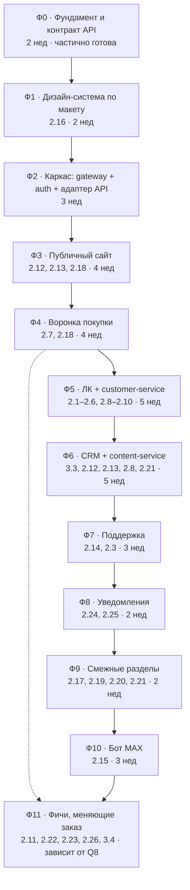

# DonBilet — Roadmap

**Версия:** 2.0 · **Дата:** 07.09.2026 · **Статус:** на согласовании
**Исполнитель:** соло-разработчик + Claude Code
**Договор:** №4063 от 10.08.2026, Приложение № 1

> **Что изменилось против версии 1.0.** Найдены материалы, которых не было при
> первом планировании: Postman-коллекция действующего API DonBilet с примерами
> ответов, дамп схемы БД, обзорная документация. Плюс решение владельца:
> **legacy-код не переносится, всё делается с нуля по макету и действующему API**.
> Backend DonBilet остаётся и не переписывается.
>
> Объём сократился с **76 недель до ~34**: сняты фазы переписывания 12 интеграций
> с перевозчиками, booking, ticketing, payment и вывода iDempiere.

---

## 0. Документы проекта

| Документ | Что в нём |
|---|---|
| [tz.md](tz.md) | ТЗ: 26 функциональных пунктов + 5 технических требований |
| [api-donbilet-v2.md](api-donbilet-v2.md) | **Фактический контракт API DonBilet** из Postman-коллекции |
| [DonBilet — технологический стек и целевая архитектура.md](DonBilet%20—%20технологический%20стек%20и%20целевая%20архитектура.md) | Целевая архитектура (её горизонт шире текущего договора — см. §1.2) |
| **roadmap.md** (этот файл) | Фазы, зависимости, оценки, приёмка |
| [../08-соответствие-ТЗ-Приложение-1.md](../08-соответствие-ТЗ-Приложение-1.md) | Что из ТЗ уже работает в legacy |
| [../01–07](../README.md) | Аудит legacy: стек, архитектура, API, данные, риски |
| `audit/ROADMAP.md`, `audit/CURRENT.md` | Утверждённый scope и фактическое состояние |

---

## 1. Границы работ

### 1.1. Что делаем

**Новый фронтенд с нуля** — по макету, без переноса кода Angular 8. Старый фронт
используется только как источник знаний о поведении (какие поля, какие сценарии).

**Новый backend — только под то, чего нет в API DonBilet:** избранное, сохранённые
пассажиры, чат поддержки, контент с админкой, оценки, уведомления, CRM.

**Действующий API DonBilet — как внешняя система.** Поиск, воронка покупки,
платежи, билеты, базовый ЛК работают через него.

```
        Next.js (новый фронт по макету)      Next.js CRM
                        │                         │
                        └───────────┬─────────────┘
                                    ▼
                              Traefik → gateway (NestJS)
                                    │
                ┌───────────────────┴───────────────────┐
                ▼                                       ▼
      donbilet-api-adapter                    собственные сервисы
      ключи apikey/apitoken                   customer · content
      X-Crfs-token → сессия                   support · notification
                │
                ▼
      API DonBilet /WSv2  ──►  iDempiere  ──►  перевозчики, платежи
      (не наш, не переписываем)
```

### 1.2. Что НЕ делаем

- **Не переносим legacy-код** — ни Angular-компоненты, ни Java-модули.
- **Не переписываем backend DonBilet**: 12 интеграций с перевозчиками, booking,
  ticketing, payment, фискализация остаются как есть.
- **Не выводим iDempiere.** Полная замена платформы (§49 целевой архитектуры) —
  отдельный проект за рамками договора №4063.
- Пп. 4.1–4.9 ТЗ (исключения, названные в самом ТЗ).

### 1.3. Ключевое ограничение

Шесть пунктов ТЗ **невозможно закрыть без изменений в API DonBilet** — они меняют
состав и сумму заказа, а она формируется в `/reserve/addpass` и уходит в оплату
через `/reserve/buy`:

| Пункт | Что требует ТЗ | Почему не закрывается снаружи |
|---|---|---|
| 2.11 Страховка | Позиция в заказе, сумма в общем платеже | Сумму считает их backend |
| 2.22 Отель в заказе | Позиция в заказе, общий платёж | То же |
| 2.23 Промокоды | Применение **на экране оплаты**, лимит использований | Купон применяется в `addpass`, лимитов в API нет |
| 2.26 Туда-обратно | Два сегмента, единый платёж, компенсация при сбое | Один заказ = один рейс |
| 2.1 (частично) | Проверка принадлежности PDF пользователю | `/main/getticket` не проверяет сессию |
| 2.10 (частично) | TTL кода 15 мин, лимит отправки 60 с | Логика на их стороне |

**Это вопрос Q8 — требует решения владельца до Ф4.** Варианты в §7.

---

## 2. Зафиксированные решения

| # | Решение | Статус |
|---|---|---|
| R1 | Стек: Next.js 16 + NestJS + PostgreSQL/Prisma + Redis + Traefik + Docker Compose | принято |
| R2 | Реализация на шаблоне `arch-saas` (ADR-0005) | принято |
| R3 | **Legacy не переносится. Фронт с нуля по макету, backend DonBilet как внешний API** | принято 07.09.2026 |
| R4 | **iDempiere не выводится в рамках договора №4063** | принято 07.09.2026 |
| R5 | Ключи `apikey`/`apitoken` держит gateway, в браузер не попадают | принято |
| R6 | Figma на web и ЛК — от заказчика; CRM проектируем сами | принято |
| R7 | Исполнение: соло + Claude Code, фазы последовательные | принято |
| R8 | Скоупы данных: `global` / `workspace` / `customer` (ADR-0006) | **требует утверждения до Ф5** |

---

## 3. Карта фаз



| Фаза | Оценка | Пункты ТЗ |
|---|---:|---|
| Ф0 Фундамент и контракт API | 2 нед | подготовка 2.20 |
| Ф1 Дизайн-система | 2 нед | 2.16 |
| Ф2 Каркас платформы | 3 нед | — |
| Ф3 Публичный сайт | 4 нед | 2.12 (публ.), 2.13 (публ.), 2.18 |
| Ф4 Воронка покупки | 4 нед | 2.18, 2.7 |
| Ф5 ЛК + customer-service | 5 нед | 2.1–2.6, 2.8 (польз.), 2.9, 2.10 |
| Ф6 CRM + content-service | 5 нед | 3.3, 2.12, 2.13, 2.8 (адм.), 2.21 (справочник) |
| Ф7 Поддержка | 3 нед | 2.14, 2.3 |
| Ф8 Уведомления | 2 нед | 2.24, 2.25 |
| Ф9 Смежные разделы | 2 нед | 2.17, 2.19, 2.20, 2.21 |
| Ф10 Бот MAX | 3 нед | 2.15 |
| **Итого без Ф11** | **35 нед ≈ 8 мес.** | **20 из 26 пунктов** |
| Ф11 Фичи, меняющие заказ | 3–10 нед | 2.11, 2.22, 2.23, 2.26, 3.4 |

Оценки — рабочие недели полной занятости соло с активным использованием агентов,
без учёта простоев на согласованиях (по п. 6 ТЗ — до 3 рабочих дней на каждое).

---

## 4. Формат работы

- `audit/ROADMAP.md` — утверждённый scope и статусы фаз.
- `audit/CURRENT.md` — фактическое состояние, обновляется еженедельно.
- `audit/reports/YYYY-MM-DD-phase-NN-<slug>.md` — **один отчёт на фазу целиком**.
- ADR в `backend/docs/adr/` — на любое отклонение от roadmap или архитектуры.

### Definition of Done фазы

- [ ] Функциональность соответствует описанию пунктов ТЗ (приёмка по п. 5.2 — по каждому пункту отдельно)
- [ ] `bun run build:all` и `bun run lint` без ошибок; `tsc --noEmit` на фронте чист
- [ ] Миграции применены; новые tenant-таблицы имеют RLS и запись в `model-ownership.yml`
- [ ] `bun run test:rls` и `npm run smoke` проходят
- [ ] Playwright-сценарии фазы проходят
- [ ] Отчёт в `audit/reports/` с воспроизводимыми evidence
- [ ] `audit/CURRENT.md` обновлён

---

## 5. Роли

Соло + Claude Code. Роли — полосы ответственности, не люди.

| Роль | Кто | Ответственность |
|---|---|---|
| Техлид | человек | Архитектура, ADR, ревью, доступы, согласования, приёмка |
| Агент «фронт» | Claude Code | Next.js по макету, `components/ui`, формы, состояния |
| Агент «бэк» | Claude Code | NestJS-сервисы, Prisma, DTO, OpenAPI |
| Агент «интеграции» | Claude Code | `donbilet-api-adapter`, нормализация ответов |
| Агент «QA» | Claude Code | Playwright, контрактные тесты адаптера |

**Не делегируется агентам:** всё, что касается денег (суммы заказа, возвраты),
PII (документы пассажиров), миграции данных, RBAC в CRM.

---

# Фазы

## Ф0. Фундамент и контракт API

**Оценка:** 2 недели · **Статус:** частично выполнена

### Выполнено
- Шаблон развёрнут под DonBilet, инфраструктура работает (`smoke` 20/20, `test:rls` 7/7)
- Edge переведён на Traefik (§7 архитектуры)
- Порты разведены с соседним проектом (диапазон 52xx)
- ADR-0005 (структура репозитория), ADR-0006 (скоупы данных)
- Дата-слой публичной части: валидаторы, api-модули, стор поиска
- **Контракт API DonBilet извлечён** из Postman-коллекции → `api-donbilet-v2.md`

### Осталось
1. **Получить рабочий стенд API** — адрес из коллекции не отвечает. Блокер.
2. **Уточнить контракты без примеров**: `/details`, `/lk/startreturn`,
   `/lk/returncode`, `/main/getticket`, контентные методы.
3. **Развернуть `dbscheme.sql.gz`** локально — справочник по данным DonBilet
   (~900 таблиц, из них `sib_*` — прикладные). Не для миграции, а чтобы понимать
   смысл полей API.
4. **Аудит раздела Авиа** (п. 2.20 ТЗ требует явно) и партнёрских виджетов ЖД/Отели.
5. **Получить Figma.**

### DoD
- [ ] Запросы из Postman-коллекции воспроизводятся против рабочего стенда
- [ ] Контракты эндпоинтов без примеров задокументированы
- [ ] `api-donbilet-v2.md` дополнен и согласован с заказчиком
- [ ] Объём п. 2.20 определён письменно
- [ ] Figma получен

---

## Ф1. Дизайн-система по макету

**Оценка:** 2 недели · **ТЗ:** 2.16, основа для 2.17–2.20, 3.5

Токены из Figma (палитра с HEX, типографика, spacing, радиусы, тени, брейкпоинты)
→ тема Tailwind в `frontend/assets/styles/global.css`. Логотип в трёх вариантах.
Компоненты по макету поверх существующих `components/ui` (48 готовых примитивов) —
переиспользуем, а не пишем заново. Отдельно кит для CRM.

**DoD:** все состояния компонентов на витрине; контраст ≥ 4.5:1; `DESIGN.md` написан.

---

## Ф2. Каркас платформы

**Оценка:** 3 недели

- **`gateway`**: `/api/v1`, requestId/correlationId, единый формат ошибок,
  rate limiting, OpenAPI.
- **`donbilet-api-adapter`**: типизированный клиент к `/WSv2`. Держит `apikey`/
  `apitoken` на сервере, транслирует сессию, нормализует ответы в канонические DTO
  (строки-числа → числа, `"Y"`/`"N"` → boolean, три формата дат → ISO), валидирует
  zod на границе. Таймауты, retry, circuit breaker.
- **`auth-service`**: собственные сессии, Argon2id, HttpOnly-cookies, RBAC для CRM.
  Связка учётной записи DonBilet (`userID` + `X-Crfs-token`) с нашей — нужна для
  избранного и сохранённых пассажиров.
- Контрактные тесты адаптера на фикстурах из Postman-коллекции.

**DoD:** вход работает через API DonBilet; адаптер проходит контрактные тесты;
ключи приложения в браузер не попадают — проверено негативным тестом.

---

## Ф3. Публичный сайт

**Оценка:** 4 недели · **ТЗ:** 2.12 (публ.), 2.13 (публ.), 2.18

Главная, поиск, результаты, детали рейса, расписания и SEO-страницы направлений,
FAQ, новости, о нас, контакты, оферта, политика, b2b.

**SEO — критический блок.** Сайт много лет в выдаче: полная карта старых URL,
301-редиректы, sitemap, канонические, метатеги. Карта восстанавливается из логов
веб-сервера.

Выкат — path-based через Traefik, канареечно, с откатом одним переключателем.

**DoD:** все старые URL отвечают 200 или 301; Core Web Vitals не хуже прежних;
две недели мониторинга Search Console без просадки трафика.

---

## Ф4. Воронка покупки

**Оценка:** 4 недели · **ТЗ:** 2.18, 2.7

Экраны по макету: выбор рейса → места → пассажиры → оплата → результат.
Через API DonBilet: `/start/ticket` → `/reserve/ctzn` → `/reserve/addpass` →
`/reserve/buy` → переход на `merchantURL` → `/reserve/result`.

Состояние воронки — серверный booking-контекст в Redis плюс минимум в URL, а не
15 query-параметров с cookies и sessionStorage, как в legacy.

**2.7 Отель на подтверждении** — партнёрский виджет на странице результата,
заказ не меняет, поэтому здесь.

Учесть: `/reserve/result` в legacy удерживает соединение до 40 с — нужен таймаут
и честная индикация ожидания.

**DoD:** сквозной сценарий покупки проходит на тестовом платёжном контуре;
канареечный выкат 10 % на неделю без просадки конверсии; откат проверен.

---

## Ф5. ЛК + customer-service

**Оценка:** 5 недель · **ТЗ:** 2.1–2.6, 2.8 (польз.), 2.9, 2.10 · **Ядро договора**

Первый собственный доменный сервис. Требует утверждения ADR-0006 (R8).

| Пункт | Источник данных |
|---|---|
| 2.1 Мои билеты | API DonBilet `/lk/mytickets` + наш слой скрытия |
| 2.2 История | `/lk/myhistory` |
| 2.3 Сообщения | `/lk/messages` **+ наша таблица** для дат и прочитанности — в API их нет |
| 2.4 Профиль | `/lk/userinfo`, `/lk/edit` |
| 2.5 Избранное | **полностью наше** |
| 2.6 Пассажиры (до 10) | **полностью наше**, документы шифруются на уровне приложения |
| 2.8 Оценка | **наше** (в API нет), проверка владения билетом обязательна |
| 2.9 VK/Яндекс ID | **наше**, `auth-service`, связка по email |
| 2.10 Подтверждение email | наше: TTL 15 мин, лимит 60 с, `SecureRandom` |

**DoD:** каждый из 9 пунктов принят отдельно; документы пассажиров зашифрованы и
не попадают в логи; негативный тест на доступ к чужим данным.

---

## Ф6. CRM + content-service

**Оценка:** 5 недель · **ТЗ:** 3.3, 2.12, 2.13, 2.8 (адм.), 2.21 (справочник), 2.3 (источник)

Отдельная панель администрирования — п. 3.3 прямо запрещает использовать
техническую консоль платформы. RBAC, audit log. Разделы: Контент, Настройки,
Клиенты, Оценки, Уведомления о рейсах.

`content-service`: Page, News, Faq, Banner, SeoPage, LegalDocument, AirDirection.
TipTap, файлы в S3. **RSS-фид для Дзена** (2.12).

**DoD:** контент-менеджер публикует новость и правит FAQ без разработчика —
проверено на реальном сотруднике заказчика; RSS проходит валидацию Дзена;
CSV с оценками открывается в Excel без битой кириллицы.

---

## Ф7. Поддержка

**Оценка:** 3 недели · **ТЗ:** 2.14, 2.3

WebSocket-чат, диалоги, вложения в S3, рабочее место оператора в CRM.
Traefik апгрейдит соединение прозрачно — отдельной настройки не требует.

**DoD:** сообщение оператора доходит менее чем за секунду; переподключение
восстанавливает диалог; параллельные операторы не дублируют ответы.

---

## Ф8. Уведомления

**Оценка:** 2 недели · **ТЗ:** 2.24, 2.25

`notification-service`: шаблоны, Email/SMS, BullMQ, retry, статусы доставки.
SMS реализуется по-настоящему — в legacy это заглушка на 14 строк.
2.24 — фоновая проверка цен по избранному (Ф5). 2.25 — интервал настраивается в CRM.

**DoD:** SPF/DKIM/DMARC настроены; интервал напоминания меняется без деплоя.

---

## Ф9. Смежные разделы

**Оценка:** 2 недели · **ТЗ:** 2.17, 2.19, 2.20, 2.21

ЖД и Отели — обёртки над партнёрскими виджетами (`tripandfly`, `hotels.donbilet`);
глубина кастомизации определена аудитом Ф0. Авиа — по результатам аудита.
2.21 — карточка кросс-перехода после результатов поиска.

**DoD:** ограничения кастомизации виджетов зафиксированы письменно и согласованы
до приёмки — иначе спор на сдаче.

---

## Ф10. Бот MAX

**Оценка:** 3 недели · **ТЗ:** 2.15

Диалог поверх готового API, бизнес-логики в боте нет. Оплата — нативным
механизмом MAX либо ссылкой на ту же страницу оплаты сайта.

**DoD:** сквозная покупка в диалоге на тестовом контуре; PDF приходит файлом;
обрыв диалога не теряет состояние.

---

## Ф11. Фичи, меняющие заказ

**Оценка:** 3–10 недель · **ТЗ:** 2.11, 2.22, 2.23, 2.26, 3.4 · **Зависит от Q8**

Объём определяется ответом на Q8 (§7). Пока решения нет, фаза не планируется
по срокам, а пункты считаются незакрытыми.

---

## 6. Матрица покрытия ТЗ

| Пункт | Источник | Фаза |
|---|---|---|
| 2.1 Мои билеты | API + наш слой | Ф5 |
| 2.2 История поездок | API | Ф5 |
| 2.3 Сообщения | API + наша таблица | Ф5, Ф6, Ф7 |
| 2.4 Профиль | API | Ф5 |
| 2.5 Избранное | наше | Ф5 |
| 2.6 Пассажиры | наше | Ф5 |
| 2.7 Отель на подтверждении | виджет партнёра | Ф4 |
| 2.8 Оценка перевозчика | наше | Ф5, Ф6 |
| 2.9 VK / Яндекс ID | наше | Ф5 |
| 2.10 Подтверждение email | наше | Ф5 |
| **2.11 Страховка** | **нужны изменения API** | **Ф11 / Q8** |
| 2.12 Новости + RSS | наше | Ф3, Ф6 |
| 2.13 Справочная | наше | Ф3, Ф6 |
| 2.14 Поддержка | наше | Ф7 |
| 2.15 Бот MAX | наше поверх API | Ф10 |
| 2.16 Брендинг | макет | Ф1 |
| 2.17 Редизайн ЖД | виджет партнёра | Ф9 |
| 2.18 Редизайн Авто | API | Ф3, Ф4 |
| 2.19 Редизайн Отели | виджет партнёра | Ф9 |
| 2.20 Редизайн Авиа | по аудиту Ф0 | Ф9 |
| 2.21 Кросс-переход | наше | Ф6, Ф9 |
| **2.22 Отель в заказе** | **нужны изменения API** | **Ф11 / Q8** |
| **2.23 Промокоды** | **нужны изменения API** | **Ф11 / Q8** |
| 2.24 Снижение цены | наше | Ф8 |
| 2.25 Напоминание | наше | Ф8 |
| **2.26 Туда-обратно** | **нужны изменения API** | **Ф11 / Q8** |
| 3.1 Консолидация модулей | вне объёма (R4) | — |
| 3.2 Совместимость мобильного API | выполняется само: API не меняется | — |
| 3.3 Админ-панель | наше | Ф6 |
| **3.4 Единообразие форм заказа** | **нужны изменения API** | **Ф11 / Q8** |
| 3.5 Оформление ЛК по айдентике | макет | Ф1, Ф5 |

**П. 3.1 требует внимания.** ТЗ требует консолидировать два дублирующих модуля
(`donbilet.webservices` и `personalaccount`). Это работа в backend DonBilet, который
мы по R4 не трогаем. Пункт либо передаётся их разработчику, либо исключается
допсоглашением — вопрос Q9.

---

## 7. Открытые вопросы

| # | Вопрос | Нужен до | Почему важно |
|---|---|---|---|
| **Q8** | **Кто и как реализует 2.11, 2.22, 2.23, 2.26, 3.4?** Варианты: (а) их разработчик расширяет API; (б) мы получаем доступ к их backend и делаем сами; (в) переносим домен заказа к себе — это возвращает объём трека B; (г) пункты выносятся допсоглашением | **Ф4** | 5 пунктов ТЗ и оценка фазы Ф11 |
| **Q9** | П. 3.1 (консолидация модулей) — их разработчик или исключаем? | Ф2 | Пункт в договоре, но в чужом коде |
| Q10 | Актуальный base URL и ключи API. Стенд из коллекции не отвечает | **Ф2** | Без него нельзя разрабатывать и тестировать |
| Q1 | Срок по договору — калибровка оценок | Ф1 | 35 недель — рабочая гипотеза |
| Q6/R8 | Утвердить ADR-0006 (скоупы `global`/`workspace`/`customer`) | Ф5 | Структура всех доменных сервисов |
| Q7 | Порог отката по конверсии для канареечных выкатов | Ф4 | Критерий автоотката |
| Q11 | Контакт разработчика, сопровождающего backend DonBilet | Ф2 | Уточнение контрактов, вопросы Q8/Q9 |

---

## 8. Риски

| # | Риск | Влияние | Митигация |
|---|---|---|---|
| P1 | **API DonBilet недоступен для разработки** | Блокирует Ф2–Ф5 | Q10 — приоритетный запрос. До получения работаем на фикстурах из Postman-коллекции |
| P2 | Потеря SEO-трафика при переносе фронта | Выручка | Карта редиректов, канареечный выкат, мониторинг |
| P3 | Падение конверсии воронки | Выручка | Канареечный выкат, посуточное сравнение, автооткат |
| P4 | **Q8 решается не в нашу пользу** — 5 пунктов ТЗ повисают | Неполная сдача | Поднять вопрос немедленно, до Ф4 |
| P5 | API DonBilet меняется без предупреждения | Регрессии | Контрактные тесты адаптера на фикстурах |
| P6 | Контракты без примеров окажутся сложнее ожидаемого | Сдвиг Ф4–Ф5 | Уточнить в Ф0, до планирования |
| P7 | Виджеты партнёров не кастомизируются под макет | Спор на приёмке 2.17/2.19 | Зафиксировать ограничения письменно в Ф0 |
| P8 | Объём не помещается в срок соло | Срыв | Q1 + рычаги: отложить Ф10, вынести Ф11 |

---

## 9. Что нужно от заказчика

Приоритет по убыванию:

- [ ] **Актуальный base URL и ключи API DonBilet** (Q10) — блокирует разработку
- [ ] **Figma на web и ЛК** — блокирует Ф1
- [ ] **Решение по Q8** — 5 пунктов ТЗ
- [ ] Контакт разработчика backend DonBilet (Q11)
- [ ] Контракты эндпоинтов без примеров в коллекции
- [ ] Логи веб-сервера за 3 месяца — карта URL для SEO-редиректов
- [ ] Доступ к DNS, Метрике, Search Console
- [ ] Информация о разделе Авиа: где размещён, чей код
- [ ] Срок по договору (Q1)
